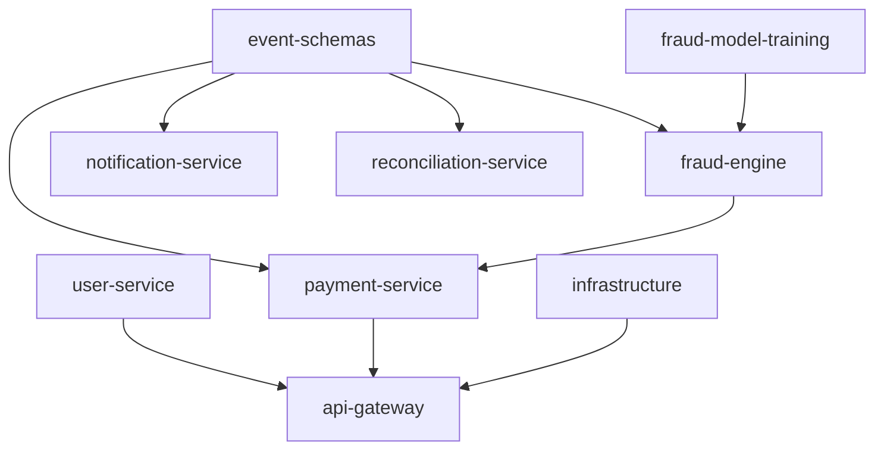

« # Per-Service Implementation Plans

## Goal

Create one implementation plan per repo under [docs/plans/](docs/plans/), written as a senior engineer would hand it to the team: current state grounded in real files, target design, milestone-sized PRs (under 400 lines per [CONTRIBUTING.md](CONTRIBUTING.md)), contracts, testing, and definition of done.

All files land in the umbrella repo. Nothing is written inside `services/*` so no submodule working tree is dirtied and the repo's golden rule holds.

## Files to create

- [docs/plans/README.md](docs/plans/README.md) — index, shared template, build order, cross-cutting gaps
- [docs/plans/payguard-event-schemas.md](docs/plans/payguard-event-schemas.md)
- [docs/plans/payguard-fraud-engine.md](docs/plans/payguard-fraud-engine.md)
- [docs/plans/payguard-payment-service.md](docs/plans/payguard-payment-service.md)
- [docs/plans/payguard-user-service.md](docs/plans/payguard-user-service.md)
- [docs/plans/payguard-api-gateway.md](docs/plans/payguard-api-gateway.md)
- [docs/plans/payguard-notification-service.md](docs/plans/payguard-notification-service.md)
- [docs/plans/payguard-reconciliation-service.md](docs/plans/payguard-reconciliation-service.md)
- [docs/plans/payguard-fraud-model-training.md](docs/plans/payguard-fraud-model-training.md)
- [docs/plans/payguard-infrastructure.md](docs/plans/payguard-infrastructure.md)

Plus one small edit: add a `Service implementation plans` row and an `Architecture documentation` row to the Documentation table in [README.md](README.md), since the architecture HTML is currently not linked from anywhere.

## Shared template (every plan)

Mirrors the existing house style in [docs/adr/README.md](docs/adr/README.md) and [docs/runbooks/README.md](docs/runbooks/README.md): front-matter block, then numbered sections.

- Header: Owner `@bereket-7`, Status `Draft`, Date, Repo URL, Depends on
- 1 Purpose and boundaries — what it owns, explicitly what it does not own
- 2 Current state — cited from real files, so nobody re-discovers the scaffold
- 3 Target design — package layout, mermaid diagram where flow is non-obvious
- 4 Milestones — M1..Mn, each a single reviewable PR with a conventional-commit branch name and its own definition of done
- 5 Interfaces and contracts — REST endpoints, Kafka topics produced/consumed, Avro schema references
- 6 Data model and migrations — tables, keys, Flyway baseline
- 7 Configuration — env vars from [local-dev/.env.example](local-dev/.env.example), port, `application.yml` keys
- 8 Testing strategy — JUnit 5 / Mockito units, Testcontainers integration, contract tests
- 9 Observability and SLOs — metrics, tracing spans, alert hooks into the existing runbooks
- 10 Security — auth, tenancy via `merchant_id`, secrets
- 11 Risks and open questions — flagged for ADRs
- 12 Definition of done

## Build order encoded in the plans

Sequencing rationale: schemas are a compile-time dependency for every producer and consumer, and fraud-engine plus payment-service are the only services on the synchronous critical path per [ADR-003](docs/adr/ADR-003-sync-payment-to-fraud-engine.md).

## Per-plan specifics worth calling out

- **event-schemas** — `payment.failed` is created by [local-dev/docker-compose.yml](local-dev/docker-compose.yml) and documented in the architecture doc, but has no `.avsc`. Plan adds it, plus a Maven-published `payguard-event-schemas` artifact so Java services get generated Avro classes instead of hand-written DTOs, and a Schema Registry backward-compatibility check in CI.
- **fraud-engine** — `RulesFallbackEngine` is currently an empty final class with a private constructor. Milestones: rules engine first (so a decision path exists without a model), then Redis feature client, then `onnxruntime` scoring keyed by the `payguard.model-uri` property already present in its `application.yml`, then model-version tagging required by [ADR-002](docs/adr/ADR-002-python-trains-java-serves.md).
- **payment-service** — `OutboxEntry` exists as a bare record. Plan covers the Stripe charge flow, webhook signature verification, the Resilience4j circuit breaker around the fraud call, and flags that the outbox relay needs an ADR because the architecture doc specifies Debezium CDC but there is no Kafka Connect in the local stack.
- **user-service / api-gateway** — JWT issuance and independent per-service validation; gateway needs Redis-backed `RequestRateLimiter`, which also resolves why a `db-api-gateway` Postgres exists locally while the architecture doc shows the gateway as stateless.
- **notification / reconciliation** — idempotent consumers with a dead-letter topic, which [docs/runbooks/kafka-consumer-lag.md](docs/runbooks/kafka-consumer-lag.md) Scenario D already assumes exists.
- **fraud-model-training** — `train_xgboost.py` prints a scaffold message and `evaluate.py` and `export_onnx.py` are docstring-only. Plan covers the feature contract shared with serving, holdout metrics gating promotion, `skl2onnx` export, S3 publish, and pinning `requirements.txt` with `==` plus adding `pytest` as CONTRIBUTING requires.
- **infrastructure** — all four terraform modules are comment-only. Plan sequences remote state, VPC, then EKS/RDS/MSK/ElastiCache/S3, per-service Kustomize overlays with the `app`/`component`/`version` labels CONTRIBUTING mandates, resource limits, HPA for the critical path, and extending `terraform-plan.yml` beyond the `eks` module.

## Cross-cutting gaps recorded in docs/plans/README.md

Found during review, each assigned to the owning plan rather than fixed here:

- Local port collisions: gateway has no `server.port` so it defaults to 8080 which Kafka UI already binds; user-service is on 8081 which Schema Registry already binds
- `FRAUD_ENGINE_BASE_URL=http://localhost:8084` in `.env.example` points at notification-service; fraud-engine listens on 8083
- No CI workflow exists in any service submodule; only the umbrella and infrastructure repos have workflows
- Every Java `pom.xml` carries only web, actuator and test — no JPA, Postgres driver, Kafka, Avro, Redis, Resilience4j, onnxruntime, Stripe, Spring Security, Testcontainers, Flyway or micrometer-prometheus
- `terraform/eks/variables.tf` puts two arguments on one line separated by a comma, which HCL rejects; needs `terraform validate` verification
- Dockerfiles are single-stage and run as root

## Out of scope

Writing any service code, editing anything under `services/*`, and creating ADR-004 for the outbox decision. The plans record these as next actions. » 