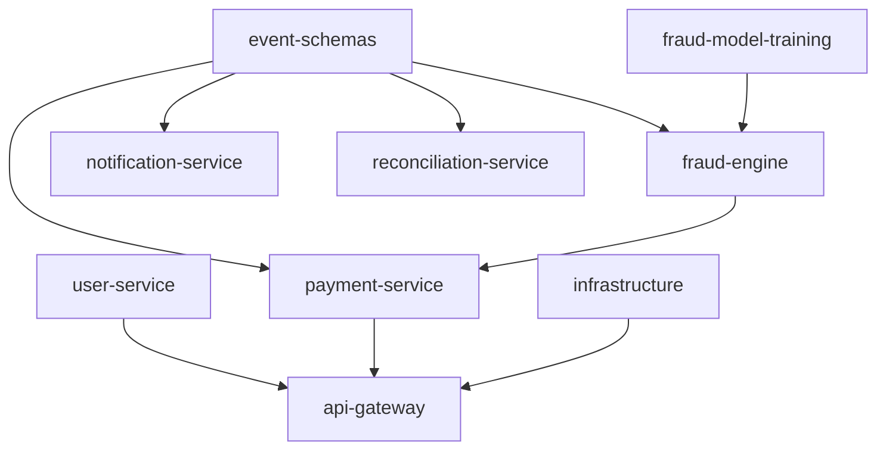

# Service Implementation Plans

One implementation plan per PayGuard repository. Each plan records what exists in the submodule **today**, the target design from [`docs/PayGuard-Architecture.html`](../PayGuard-Architecture.html), and the milestone-sized pull requests that close the gap.

Plans live in this umbrella repo — not inside the submodules — so a plan can be read, reviewed, and revised without dirtying a submodule working tree or opening nine PRs. Service *code* still ships from the service repo, per the golden rule in [`CONTRIBUTING.md`](../../CONTRIBUTING.md).

---

## Index

| Plan | Repo | Language | Critical path |
|---|---|---|---|
| [**Gap remediation (platform)**](gap-remediation-plan.md) | `payguard-core` + all submodules | — | CI, tests, E2E, docs, K8s |
| [payguard-event-schemas](payguard-event-schemas.md) | `payguard-event-schemas` | Avro | Blocks all producers/consumers |
| [payguard-fraud-engine](payguard-fraud-engine.md) | `payguard-fraud-engine` | Java | Yes |
| [payguard-payment-service](payguard-payment-service.md) | `payguard-payment-service` | Java | Yes |
| [payguard-user-service](payguard-user-service.md) | `payguard-user-service` | Java | Yes (auth) |
| [payguard-api-gateway](payguard-api-gateway.md) | `payguard-api-gateway` | Java | Yes (edge) |
| [payguard-notification-service](payguard-notification-service.md) | `payguard-notification-service` | Java | No |
| [payguard-reconciliation-service](payguard-reconciliation-service.md) | `payguard-reconciliation-service` | Java | No |
| [payguard-fraud-model-training](payguard-fraud-model-training.md) | `payguard-fraud-model-training` | Python | No (offline) |
| [payguard-infrastructure](payguard-infrastructure.md) | `payguard-infrastructure` | HCL / YAML | Deploy blocker |

---

## Build order

Schemas are a compile-time dependency for every producer and consumer, so they go first. Fraud Engine and Payment Service follow because they are the only services on the synchronous critical path defined in [ADR-003](../adr/ADR-003-sync-payment-to-fraud-engine.md).



Recommended sequence:

1. `payguard-event-schemas` — publish the contract artifact
2. `payguard-fraud-engine` — rules decision path, then Redis features, then ONNX
3. `payguard-payment-service` — Stripe charge, sync fraud call, outbox
4. `payguard-user-service` — token issuance
5. `payguard-api-gateway` — routing, rate limiting, JWT pre-validation
6. `payguard-notification-service` and `payguard-reconciliation-service` — consumers, in parallel
7. `payguard-fraud-model-training` — replace the rules-only decision with a real model
8. `payguard-infrastructure` — continuously, ahead of each deploy milestone

---

## Plan template

Copy this into a new file named `payguard-<service>.md` and add a row to the index above.

```markdown
# Implementation Plan: payguard-<service>

**Owner:** @handle
**Status:** Draft | In progress | Complete
**Last updated:** YYYY-MM-DD
**Repo:** github.com/bereket-7/payguard-<service>
**Depends on:** <repos or plans that must land first>

## 1. Purpose and boundaries
<!-- What this service owns, and explicitly what it does not own -->

## 2. Current state
<!-- Cite real files. Anyone reading this should not need to re-explore the repo -->

## 3. Target design
<!-- Package layout, mermaid diagram where the flow is non-obvious -->

## 4. Milestones
<!-- M1..Mn. Each milestone is ONE reviewable PR (< 400 lines) with its own DoD -->

## 5. Interfaces and contracts
<!-- REST endpoints, Kafka topics produced/consumed, Avro schema references -->

## 6. Data model and migrations

## 7. Configuration
<!-- Port, env vars from local-dev/.env.example, application.yml keys -->

## 8. Testing strategy
<!-- JUnit 5 / Mockito units, Testcontainers integration, contract tests -->

## 9. Observability and SLOs

## 10. Security

## 11. Risks and open questions
<!-- Anything needing an ADR -->

## 12. Definition of done
```

---

## Cross-cutting gaps

> **Active remediation plan:** [gap-remediation-plan.md](gap-remediation-plan.md) — step-by-step PRs for CI, tests, E2E, ML contract gates, docs sync, and K8s completeness. **Implemented 2026-08-11** — see plan §11 for remaining optional items (event-schemas GitHub Packages publish, Testcontainers integration tests).

The items below were found during the July 2026 audit. **Most are now fixed.** Remaining optional work is tracked in the gap remediation plan.

### Resolved (2026-08-11)

- Local port collisions — gateway on 8090, user-service on 8086
- Wrong Fraud Engine URL in `.env.example` — corrected to 8083
- `payment.failed` / `payment.held` Avro schemas — present in event-schemas
- Per-service CI — all submodules + umbrella `platform-ci.yml` matrix
- Java dependencies — full stack in service `pom.xml` files
- Terraform HCL syntax — fixed in `variables.tf`
- Outbox relay — ADR-004 polling relay implemented
- Dockerfiles — multi-stage, non-root (uid 10001) across Java services
- K8s manifests — all six Java services have hardened base manifests

### Historical notes (July 2026 audit)

### Local port collisions

- The API Gateway sets no `server.port` in [`application.yml`](../../services/payguard-api-gateway/src/main/resources/application.yml), so Spring Boot defaults to **8080** — already bound by Kafka UI in [`local-dev/docker-compose.yml`](../../local-dev/docker-compose.yml).
- User Service is on **8081** — already bound by Schema Registry.
- Owner: [api-gateway plan](payguard-api-gateway.md) M1, [user-service plan](payguard-user-service.md) M1.

### Wrong Fraud Engine URL in the env reference

[`local-dev/.env.example`](../../local-dev/.env.example) sets `FRAUD_ENGINE_BASE_URL=http://localhost:8084`, but Fraud Engine listens on **8083**; 8084 is Notification Service. A developer wiring the sync call from the documented default hits the wrong service.
Owner: [payment-service plan](payguard-payment-service.md) M2.

### `payment.failed` has no Avro schema

The topic is created by `kafka-init` and documented in the architecture doc, but `schemas/payment/` contains only `payment-created.avsc` and `payment-completed.avsc`.
Owner: [event-schemas plan](payguard-event-schemas.md) M1.

### No CI in any service repo

Only the umbrella ([`.github/workflows/`](../../.github/workflows/)) and `payguard-infrastructure` have workflows. The README claims per-service pipelines so that "a Python ML change doesn't re-test every Java service" — that isolation does not exist yet because there are no pipelines at all.
Owner: every plan, M1 of each.

### Java dependencies are missing platform-wide

Every service `pom.xml` declares only `spring-boot-starter-web` (or the gateway starter), `spring-boot-starter-actuator`, and `spring-boot-starter-test`. Absent across the board: Spring Data JPA, the PostgreSQL driver, Flyway, Spring for Apache Kafka, Avro + Schema Registry serdes, Spring Data Redis, Resilience4j, `com.microsoft.onnxruntime:onnxruntime`, the Stripe Java SDK, Spring Security / OAuth2 resource server, Testcontainers, and `micrometer-registry-prometheus`.
Owner: each service plan, M1.

### Terraform variables file is likely invalid HCL

[`terraform/eks/variables.tf`](../../services/payguard-infrastructure/terraform/eks/variables.tf) puts two arguments on one line separated by a comma:

```hcl
variable "region" { type = string, default = "us-east-1" }
```

HCL expects a newline between arguments inside a block. `terraform-plan.yml` runs `terraform validate` against this module, so CI should already be red — needs verification.
Owner: [infrastructure plan](payguard-infrastructure.md) M1.

### Kubernetes base is a single generic manifest

[`k8s/base/deployment.yml`](../../services/payguard-infrastructure/k8s/base/deployment.yml) defines one `payguard-service` with only an `app` label, no resource requests or limits, no liveness probe, no `securityContext`, and no HPA. `CONTRIBUTING.md` requires `app`, `component`, and `version` labels on every resource.
Owner: [infrastructure plan](payguard-infrastructure.md) M3.

### Dockerfiles are single-stage and run as root

All five service Dockerfiles copy a pre-built jar and run it as root with no non-root user and no build stage.
Owner: each service plan, M1.

### Python dependency pinning contradicts the style guide

[`requirements.txt`](../../services/payguard-fraud-model-training/requirements.txt) uses range specifiers (`pandas>=2.2,<3`), but `CONTRIBUTING.md` mandates `==` pins for reproducible training runs. `pytest` is also undeclared despite `tests/test_features.py` existing.
Owner: [fraud-model-training plan](payguard-fraud-model-training.md) M1.

### Outbox relay mechanism is undecided

The architecture doc names Debezium as the CDC relay, but there is no Kafka Connect or Debezium container in the local stack, and no `OutboxRelayConfig` in the repo. Debezium versus a polling publisher is an architectural choice that changes the local stack and the infrastructure repo.
Owner: [payment-service plan](payguard-payment-service.md) M4 — needs **ADR-004**.

### Architecture doc is unreferenced

[`docs/PayGuard-Architecture.html`](../PayGuard-Architecture.html) is the most complete description of the system and was not linked from `README.md`. Fixed as part of adding this directory.
