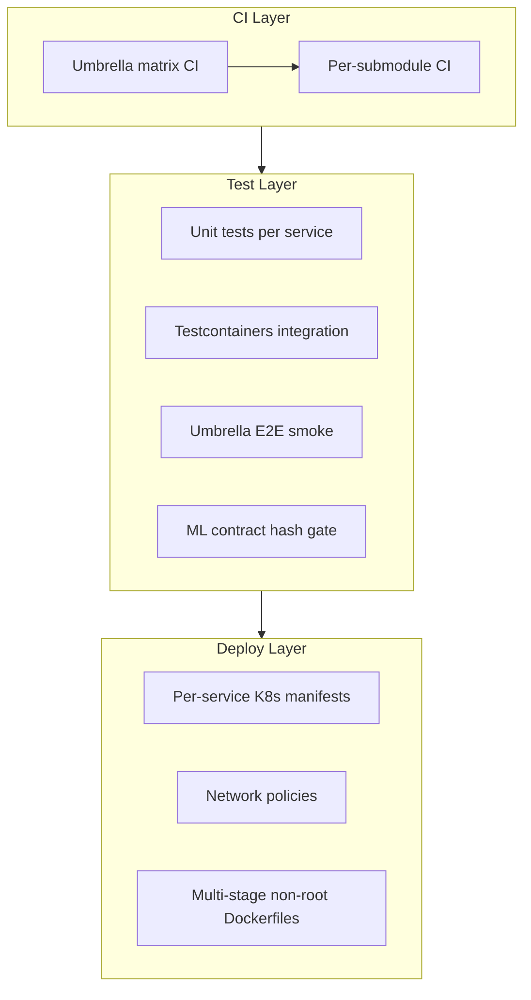
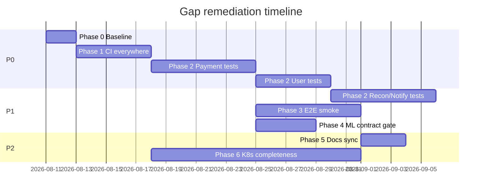

# Implementation Plan: Platform Gap Remediation

**Owner:** @bereket-7
**Status:** In progress
**Last updated:** 2026-08-11
**Scope:** Cross-cutting gaps across all PayGuard submodules
**Depends on:** Existing service implementations (see per-service plans in this directory)

---

## 1. Purpose and boundaries

This plan closes the **platform-level gaps** identified during the August 2026 codebase audit. It covers work that spans multiple submodules or lives in the umbrella repo: CI, test coverage, end-to-end verification, ML/serving contract alignment, documentation sync, and Kubernetes deploy completeness.

**In scope:**

- CI workflows missing or fragile
- Automated tests on critical-path services
- Umbrella-level E2E smoke tests
- Feature-contract gates between Python training and Java serving
- Updating stale documentation in `docs/plans/`
- Hardened K8s manifests for services not yet covered

**Out of scope:**

- New product features (handled by per-service plans)
- Replacing the polling outbox with Debezium (decided in [ADR-004](../adr/ADR-004-polling-outbox-relay.md); operational swap only)
- Production deployment to AWS (tracked in [payguard-infrastructure plan](payguard-infrastructure.md))

---

## 2. Current state

Audit findings as of 2026-08-11:

| Gap | Current state |
|---|---|
| **Test coverage** | Tests exist in event-schemas (3), fraud-engine (3), api-gateway (1), ML pipeline (2). **No tests** in payment-service, user-service, notification-service, reconciliation-service. No Testcontainers anywhere. |
| **CI** | Submodule CI exists for payment, fraud-engine, notification, reconciliation, event-schemas, ML training. **Missing:** user-service, api-gateway (submodule). Umbrella has api-gateway-ci and fraud-engine-ci only. Service CI uses sibling checkout (`../payguard-event-schemas`) which breaks standalone submodule runs. |
| **Docs drift** | Per-service plans understate implementation (e.g. payment-service plan still describes bare scaffold). `docs/plans/README.md` cross-cutting section lists issues already fixed (ports, fraud URL, `payment.failed` schema, ADR-004, multi-stage Dockerfiles). |
| **E2E verification** | No automated cross-service golden-path test in the umbrella repo. |
| **ML ↔ serving alignment** | Column names match today (`amount_minor`, `merchant_velocity_1h`, `device_risk_score`) but there is no CI gate preventing drift between `contracts/feature-contract-v1.json` and `FeatureVector.FEATURE_COLUMNS`. |
| **K8s coverage** | Hardened manifests exist for payment-service and fraud-engine only. Generic stub remains at `k8s/base/deployment.yml`. user-service, api-gateway, notification-service, reconciliation-service lack per-service manifests. |

**Already fixed (do not re-implement):**

- API Gateway port → 8090 (avoids Kafka UI collision)
- User Service port → 8086 (avoids Schema Registry collision)
- `FRAUD_ENGINE_BASE_URL` → `http://localhost:8083` in `local-dev/.env.example`
- Avro schemas for `payment.failed` and `payment.held`
- Payment-service Dockerfile → multi-stage, non-root (uid 10001)
- Terraform `variables.tf` HCL syntax
- Outbox relay decision → [ADR-004](../adr/ADR-004-polling-outbox-relay.md)

---

## 3. Target design

After this plan completes:

Every PR to `main` runs the umbrella matrix. Critical-path services have regression tests. A single E2E script proves register → pay → fraud → Kafka. ML and Java serving share a contract hash checked in CI. All six Java services deploy from hardened K8s manifests.

---

## 4. Milestones

Work is split into six phases. Each step is **one reviewable PR** (target < 400 lines changed). Steps within a phase can run in parallel unless noted.

---

### Phase 0 — Baseline inventory

**Goal:** Know what is green and red before adding work.

#### Step 0.1 — Run CI inventory

| Field | Value |
|---|---|
| **Branch** | `chore/gap-remediation-baseline` |
| **Repo** | `payguard-core` (umbrella) |
| **Files** | `docs/plans/gap-remediation-plan.md` (this file), update `docs/plans/README.md` index |

**Tasks:**

1. Trigger every existing workflow (umbrella + each submodule).
2. Run `./scripts/status.sh` and record submodule pointer state.
3. Run `./scripts/local-dev.sh up` and verify infrastructure health endpoints.
4. Document results in §2 of this plan (CI matrix table).

**Definition of done:**

- [ ] CI inventory table filled in below
- [ ] All submodule commits reachable on remote
- [ ] Local stack starts without errors

**CI inventory (filled 2026-08-11):**

| Workflow | Location | Status |
|---|---|---|
| submodule-sync-check | umbrella | Present |
| api-gateway-ci | umbrella | Present (superseded by platform-ci) |
| fraud-engine-ci | umbrella | Present (superseded by platform-ci) |
| **platform-ci** | umbrella | **Added** — full matrix + ML contract gate |
| event-schemas CI | submodule | Present |
| fraud-engine CI | submodule | Present |
| payment-service CI | submodule | Present |
| notification-service CI | submodule | Present |
| reconciliation-service CI | submodule | Present |
| fraud-model-training CI | submodule | Present |
| user-service CI | submodule | **Added** |
| api-gateway CI (submodule) | submodule | **Added** |
| terraform-plan | infrastructure submodule | Present |

---

### Phase 1 — CI everywhere

**Goal:** Every submodule has a passing CI pipeline; umbrella runs a full matrix on PR.

**Priority:** P0 — blocks confident iteration on all other phases.

#### Step 1.1 — Add CI to user-service

| Field | Value |
|---|---|
| **Branch** | `ci/user-service-verify` |
| **Repo** | `payguard-user-service` |
| **Files** | `.github/workflows/ci.yml` |

**Tasks:**

1. Copy CI pattern from `payguard-payment-service/.github/workflows/ci.yml`.
2. Remove the event-schemas install step (user-service has no Avro dependency).
3. Run `mvn -B verify` on Java 17.

**Definition of done:**

- [ ] Workflow runs on push/PR to `main`
- [ ] `mvn verify` passes

---

#### Step 1.2 — Add CI to api-gateway submodule

| Field | Value |
|---|---|
| **Branch** | `ci/api-gateway-verify` |
| **Repo** | `payguard-api-gateway` |
| **Files** | `.github/workflows/ci.yml` |

**Tasks:**

1. Mirror umbrella `api-gateway-ci.yml` into the submodule repo.
2. Confirm `GatewayRoutingIntegrationTest` runs in CI.

**Definition of done:**

- [ ] Submodule CI green independently of umbrella workflow

---

#### Step 1.3 — Umbrella CI matrix

| Field | Value |
|---|---|
| **Branch** | `ci/umbrella-matrix` |
| **Repo** | `payguard-core` |
| **Files** | `.github/workflows/platform-ci.yml` |

**Tasks:**

1. Add workflow triggered on PR/push to `main`.
2. Use `actions/checkout@v4` with `submodules: recursive`.
3. Matrix jobs:

| Job | Working directory | Pre-step |
|---|---|---|
| event-schemas | `services/payguard-event-schemas` | — |
| fraud-engine | `services/payguard-fraud-engine` | `mvn install` event-schemas |
| payment-service | `services/payguard-payment-service` | `mvn install` event-schemas |
| user-service | `services/payguard-user-service` | — |
| api-gateway | `services/payguard-api-gateway` | — |
| notification-service | `services/payguard-notification-service` | `mvn install` event-schemas |
| reconciliation-service | `services/payguard-reconciliation-service` | `mvn install` event-schemas |
| fraud-model-training | `services/payguard-fraud-model-training` | `pip install -r requirements-dev.txt && pytest` |

4. Fail the workflow if any matrix job fails.

**Definition of done:**

- [ ] Single umbrella PR shows all jobs green
- [ ] Submodule sibling-path dependency resolved via recursive checkout

---

#### Step 1.4 — Publish event-schemas artifact (optional, recommended)

| Field | Value |
|---|---|
| **Branch** | `ci/event-schemas-publish` |
| **Repo** | `payguard-event-schemas` |
| **Files** | `.github/workflows/release.yml` (extend), service `pom.xml` files |

**Tasks:**

1. Publish `com.payguard:event-schemas` to GitHub Packages on tag/release.
2. Update consuming services to resolve from registry instead of sibling install.
3. Remove `mvn -f ../payguard-event-schemas/...` pre-steps from submodule CI.

**Definition of done:**

- [ ] Services build with only registry dependency on event-schemas
- [ ] Standalone submodule clone passes CI without sibling repos

---

### Phase 2 — Test coverage on critical paths

**Goal:** Regression tests on every service that moves money, auth, or settlement data.

**Priority:** P0 for payment and user; P1 for reconciliation and notification.

**Testing stack (adopt consistently):**

- **Unit:** JUnit 5 + Mockito
- **Integration:** Testcontainers (Postgres, Kafka, Redis) — add dependency to each service `pom.xml`
- **Web layer:** `@WebMvcTest` / MockMvc for controllers

Build order follows the critical path: fraud-engine → payment → user → reconciliation → notification.

---

#### Step 2.1 — Extend fraud-engine tests

| Field | Value |
|---|---|
| **Branch** | `test/fraud-engine-coverage` |
| **Repo** | `payguard-fraud-engine` |
| **Files** | `src/test/java/...` |

**Tasks:**

1. `FeatureVectorTest` — assert column order matches feature contract (see Phase 4).
2. `ScoringServiceTest` — ONNX timeout triggers rules fallback.
3. `ScoreControllerTest` (extend) — internal service token required on `/internal/v1/score`.

**Definition of done:**

- [ ] ≥ 8 test methods across fraud-engine test suite
- [ ] `mvn verify` passes

---

#### Step 2.2 — Payment-service unit tests

| Field | Value |
|---|---|
| **Branch** | `test/payment-service-unit` |
| **Repo** | `payguard-payment-service` |
| **Files** | `src/test/java/com/payguard/payment/...` |

**Tasks:**

1. `FraudEngineClientTest` — circuit open returns safe default; timeout behavior.
2. `PaymentServiceTest` (Mockito) — state transitions: PENDING → APPROVED / BLOCKED / HELD.
3. `PaymentServiceTest` — verify no remote call happens inside a DB transaction (mock `TransactionTemplate` boundaries).
4. `OutboxRelayTest` — backoff scheduling, DLQ after max attempts, skip dead-lettered rows.

**Definition of done:**

- [ ] ≥ 5 meaningful test methods
- [ ] PR < 400 lines

---

#### Step 2.3 — Payment-service integration tests

| Field | Value |
|---|---|
| **Branch** | `test/payment-service-integration` |
| **Repo** | `payguard-payment-service` |
| **Files** | `pom.xml` (Testcontainers), `src/test/java/...` |

**Tasks:**

1. Add Testcontainers dependencies (Postgres, optionally Kafka).
2. `PaymentIntegrationTest` — POST `/v1/payments` with WireMock fraud-engine stub.
3. Assert transaction persisted and outbox row created.

**Definition of done:**

- [ ] Integration test runs in CI without manual infrastructure
- [ ] Testcontainers containers start and stop cleanly

---

#### Step 2.4 — User-service auth tests

| Field | Value |
|---|---|
| **Branch** | `test/user-service-auth` |
| **Repo** | `payguard-user-service` |
| **Files** | `src/test/java/com/payguard/user/...` |

**Tasks:**

1. Register — happy path and duplicate email (409).
2. Login — happy path, wrong password, account lockout after N failures.
3. Refresh — token rotation; revoked family on reuse.
4. Logout — refresh token revoked.
5. JWKS endpoint — returns active signing key.

**Definition of done:**

- [ ] ≥ 5 test methods covering auth flows
- [ ] Lockout threshold tested against `UserProperties`

---

#### Step 2.5 — Reconciliation-service tests

| Field | Value |
|---|---|
| **Branch** | `test/reconciliation-service` |
| **Repo** | `payguard-reconciliation-service` |
| **Files** | `src/test/java/...` |

**Tasks:**

1. `MatchingEngineTest` — expected payment matched to settlement; amount mismatch → discrepancy.
2. `ReconciliationRunServiceTest` — concurrent run rejected (`ReconciliationInProgressException`).
3. `PaymentEventConsumerTest` — duplicate event ignored via `ProcessedEvent`.

**Definition of done:**

- [ ] ≥ 5 test methods
- [ ] At least one discrepancy scenario covered

---

#### Step 2.6 — Notification-service tests

| Field | Value |
|---|---|
| **Branch** | `test/notification-service` |
| **Repo** | `payguard-notification-service` |
| **Files** | `src/test/java/...` |

**Tasks:**

1. `PaymentEventConsumerTest` — idempotent processing.
2. `FraudAlertConsumerTest` — high vs medium alert routing.
3. `NotificationServiceTest` — duplicate delivery does not create duplicate sends.
4. `TemplateServiceTest` — renders expected subject/body for event type.

**Definition of done:**

- [ ] ≥ 5 test methods
- [ ] Idempotency explicitly asserted

---

### Phase 3 — End-to-end verification

**Goal:** One automated golden-path test proving the platform works as a system.

**Priority:** P1

#### Step 3.1 — E2E smoke script

| Field | Value |
|---|---|
| **Branch** | `test/e2e-smoke-script` |
| **Repo** | `payguard-core` (umbrella) |
| **Files** | `scripts/e2e-smoke.sh`, `docs/plans/gap-remediation-plan.md` |

**Tasks:**

1. Script flow:
   - Start local stack (`./scripts/local-dev.sh up`)
   - Wait for Postgres, Kafka, Schema Registry health
   - Register merchant via user-service (or gateway)
   - Login → obtain JWT
   - POST payment via gateway
   - Assert fraud decision in response
   - Assert `payment.created` on Kafka topic (console consumer or small Java/Python helper)
2. Document prerequisites and expected output in script header.
3. Add `workflow_dispatch` job in umbrella CI (optional: run on schedule).

**Definition of done:**

- [ ] Script exits 0 on healthy stack
- [ ] Script exits non-zero with clear error on failure
- [ ] README or this plan links to the script

---

#### Step 3.2 — Payment → Fraud contract test

| Field | Value |
|---|---|
| **Branch** | `test/payment-fraud-contract` |
| **Repo** | `payguard-payment-service` |
| **Files** | `src/test/java/...` |

**Tasks:**

1. WireMock stub for `/internal/v1/score`.
2. Assert request body matches expected fields (transaction_id, merchant_id, amount_minor, currency).
3. Assert 200ms timeout triggers circuit-breaker fallback ([ADR-003](../adr/ADR-003-sync-payment-to-fraud-engine.md)).

**Definition of done:**

- [ ] ADR-003 sync call behavior is executable in CI

---

#### Step 3.3 — Outbox → Kafka → Consumer pipeline test

| Field | Value |
|---|---|
| **Branch** | `test/outbox-kafka-consumer` |
| **Repo** | `payguard-core` or `payguard-payment-service` |
| **Files** | Test module or integration test |

**Tasks:**

1. Testcontainers: Postgres + Kafka + Schema Registry.
2. Trigger outbox relay (or full payment create with mocked Stripe/fraud).
3. Consume from `payment.created`; assert Avro payload shape.
4. (Stretch) Assert notification or reconciliation consumer processes event once.

**Definition of done:**

- [ ] Event appears on Kafka within configured poll interval
- [ ] Payload deserializes against event-schemas artifact

---

### Phase 4 — ML ↔ serving contract alignment

**Goal:** Training-side feature changes break Java CI before production deploy.

**Priority:** P1

**Current alignment (verified 2026-08-11):**

| Source | Columns |
|---|---|
| `contracts/feature-contract-v1.json` | `amount_minor`, `merchant_velocity_1h`, `device_risk_score` |
| `FeatureVector.FEATURE_COLUMNS` | same |
| `src/features/contract.py` | derived from JSON |

#### Step 4.1 — Shared contract artifact

| Field | Value |
|---|---|
| **Branch** | `feat/ml-contract-artifact` |
| **Repo** | `payguard-fraud-model-training` + `payguard-fraud-engine` |
| **Files** | Contract JSON, CI hash check |

**Tasks (choose one approach):**

**Option A (recommended):** Publish `feature-contract-v1.json` as part of ML pipeline release artifact; fraud-engine loads it from classpath at startup and compares hash to embedded expected value.

**Option B (lighter):** Copy JSON into fraud-engine `src/main/resources/contracts/`; umbrella CI job diffs hashes across both repos.

**Definition of done:**

- [ ] Single JSON file is authoritative
- [ ] Defaults in JSON match `FeatureVector.from()` fallback values (0.0, 0.0, 0.5)

---

#### Step 4.2 — Contract hash CI gate

| Field | Value |
|---|---|
| **Branch** | `ci/ml-contract-hash-gate` |
| **Repo** | umbrella + both ML/fraud submodules |
| **Files** | CI workflow step, tests |

**Tasks:**

1. Python: extend `test_features.py` to assert `contract_hash()` stable and columns ordered.
2. Java: `FeatureVectorTest` loads contract resource, compares column list and defaults.
3. Umbrella CI: fail if SHA-256 of contract JSON differs between repos (Option B) or if embedded hash mismatch (Option A).

**Definition of done:**

- [ ] Reordering a feature in training breaks fraud-engine CI
- [ ] Adding a feature without updating both sides fails CI

---

#### Step 4.3 — ONNX parity gate

| Field | Value |
|---|---|
| **Branch** | `test/onnx-jvm-parity` |
| **Repo** | `payguard-fraud-engine` |
| **Files** | `src/test/java/...`, CI artifact download step |

**Tasks:**

1. Extend ML `test_export_onnx.py` (already validates JVM-loadable graphs).
2. Fraud-engine CI: load exported ONNX, run inference with known float[] input, assert probability in [0, 1].
3. Wire ML pipeline CI to upload ONNX artifact; fraud-engine CI downloads latest on `workflow_dispatch` or pinned version.

**Definition of done:**

- [ ] "Every transaction approved" class of ONNX export bugs caught before deploy

---

### Phase 5 — Documentation sync

**Goal:** Plans and README reflect the codebase as it exists today.

**Priority:** P2 (can start in parallel with Phase 2)

#### Step 5.1 — Update per-service plan "Current state" sections

| Field | Value |
|---|---|
| **Branch** | `docs/sync-plan-current-state` |
| **Repo** | `payguard-core` |
| **Files** | `docs/plans/payguard-*.md` |

**Update order (highest drift first):**

1. [payguard-payment-service.md](payguard-payment-service.md)
2. [payguard-fraud-engine.md](payguard-fraud-engine.md)
3. [payguard-user-service.md](payguard-user-service.md)
4. [payguard-api-gateway.md](payguard-api-gateway.md)
5. [payguard-notification-service.md](payguard-notification-service.md)
6. [payguard-reconciliation-service.md](payguard-reconciliation-service.md)
7. [payguard-fraud-model-training.md](payguard-fraud-model-training.md)
8. [payguard-infrastructure.md](payguard-infrastructure.md)

**For each file:**

1. Rewrite §2 Current state with real file citations.
2. Mark completed milestones `[x]` in §4.
3. Update **Status** and **Last updated** header fields.

**Definition of done:**

- [ ] No plan describes bare `@SpringBootApplication` scaffolds where full implementations exist
- [ ] Each plan's remaining milestones are accurate

---

#### Step 5.2 — Refresh cross-cutting gaps in plans README

| Field | Value |
|---|---|
| **Branch** | `docs/refresh-cross-cutting-gaps` |
| **Repo** | `payguard-core` |
| **Files** | `docs/plans/README.md` |

**Tasks:**

1. Remove or strike through fixed items (ports, fraud URL, schemas, ADR-004, Dockerfiles, deps).
2. Replace with pointer to this plan for remaining gaps.
3. Add row to index table linking [gap-remediation-plan.md](gap-remediation-plan.md).

**Definition of done:**

- [ ] Cross-cutting section reflects August 2026 reality
- [ ] This plan appears in the index

---

#### Step 5.3 — Add verification section to root README

| Field | Value |
|---|---|
| **Branch** | `docs/readme-verification-section` |
| **Repo** | `payguard-core` |
| **Files** | `README.md` |

**Tasks:**

1. Add "Verification" subsection under Documentation.
2. Link to E2E script, umbrella CI matrix, runbooks.

**Definition of done:**

- [ ] New engineer can find how to verify the platform from README alone

---

### Phase 6 — Kubernetes and deploy completeness

**Goal:** All Java services deploy from hardened manifests; generic stub removed.

**Priority:** P2

#### Step 6.1 — user-service K8s manifests

| Field | Value |
|---|---|
| **Branch** | `infra/k8s-user-service` |
| **Repo** | `payguard-infrastructure` |
| **Files** | `k8s/base/user-service/` |

**Tasks:**

1. `deployment.yml` — non-root uid 10001, probes, resource requests/limits, labels (`app`, `component`, `version`).
2. `service.yml`, `kustomization.yml`.
3. Match patterns from `k8s/base/payment-service/deployment.yml`.

**Definition of done:**

- [ ] `kubectl apply -k k8s/base/user-service` succeeds against dev cluster

---

#### Step 6.2 — api-gateway K8s manifests

Same pattern as Step 6.1 for `k8s/base/api-gateway/`.

**Definition of done:**

- [ ] Gateway deploys with port 8090, Redis rate-limit config via env

---

#### Step 6.3 — notification-service K8s manifests

Same pattern for `k8s/base/notification-service/`.

**Definition of done:**

- [ ] Consumer group and Kafka bootstrap env documented in manifest

---

#### Step 6.4 — reconciliation-service K8s manifests

Same pattern for `k8s/base/reconciliation-service/`.

**Definition of done:**

- [ ] CronJob or internal trigger endpoint documented if applicable

---

#### Step 6.5 — Network policies

| Field | Value |
|---|---|
| **Branch** | `infra/network-policies` |
| **Repo** | `payguard-infrastructure` |
| **Files** | `k8s/platform/network-policies/` |

**Tasks:**

1. Gateway → user-service, payment-service only.
2. Payment → fraud-engine (extend existing `allow-payment-to-fraud-engine.yml`).
3. Consumers → Kafka egress, Postgres internal.
4. Default-deny remains baseline.

**Definition of done:**

- [ ] Unauthorized pod-to-pod paths blocked in dev overlay

---

#### Step 6.6 — Wire all services into Kustomize overlays

| Field | Value |
|---|---|
| **Branch** | `infra/kustomize-overlays-complete` |
| **Repo** | `payguard-infrastructure` |
| **Files** | `k8s/overlays/dev/kustomization.yml`, `k8s/overlays/prod/kustomization.yml` |

**Tasks:**

1. Reference all six service bases in dev and prod overlays.
2. Delete or mark deprecated `k8s/base/deployment.yml` generic stub.

**Definition of done:**

- [ ] `kubectl apply -k k8s/overlays/dev` deploys full application stack

---

#### Step 6.7 — Dockerfile parity audit

| Field | Value |
|---|---|
| **Branch** | `chore/dockerfile-parity` |
| **Repo** | each service submodule |
| **Files** | `Dockerfile` per service |

**Tasks:**

1. Audit all service Dockerfiles against payment-service pattern:
   - Multi-stage Maven build
   - Non-root user (uid 10001)
   - `JAVA_TOOL_OPTIONS=-XX:MaxRAMPercentage=75.0`
2. Fix any single-stage or root-user Dockerfiles.

**Definition of done:**

- [ ] All six Java service Dockerfiles match hardened pattern
- [ ] K8s `runAsUser: 10001` compatible with every image

---

## 5. Interfaces and contracts

| Contract | Location | Validated by |
|---|---|---|
| Kafka events | `payguard-event-schemas` | Schema compatibility tests (existing) |
| ML features | `contracts/feature-contract-v1.json` | Phase 4 hash gate |
| Payment → Fraud | `POST /internal/v1/score` | Phase 3.2 contract test |
| Internal auth | `X-PayGuard-Internal-Token` header | Phase 2 controller tests |

---

## 6. Recommended execution order

**Parallel tracks:**

- Phase 5 (docs) can run alongside Phase 2 (tests).
- Phase 6 (K8s) can start after Phase 1 (CI) without waiting for tests.
- Phase 4 (ML contract) can start as soon as Phase 2.1 (fraud-engine tests) begins.

---

## 7. Testing strategy

| Layer | Tooling | Owner phase |
|---|---|---|
| Unit | JUnit 5, Mockito | Phase 2 |
| Integration | Testcontainers (Postgres, Kafka, Redis) | Phase 2.3, 3.3 |
| Web/API | MockMvc, WireMock | Phase 2, 3.2 |
| E2E | Shell script + curl + Kafka consumer | Phase 3.1 |
| ML/ONNX | pytest, onnxruntime | Phase 4.3 |
| Schema | Avro golden files (existing) | event-schemas CI |

**Coverage targets:**

| Service | Minimum test methods |
|---|---|
| payment-service | 10 (unit + integration) |
| fraud-engine | 8 |
| user-service | 8 |
| reconciliation-service | 5 |
| notification-service | 5 |
| api-gateway | 3 (extend existing) |

---

## 8. Observability and SLOs

Existing metrics should be validated by new tests where applicable:

| Metric | Service | Validated in |
|---|---|---|
| `fraud.score.latency` | fraud-engine | Phase 2.1 |
| `fraud.decision.count` | fraud-engine | Phase 2.1 |
| `payguard.outbox.published` | payment-service | Phase 2.2 |
| `resilience4j.circuitbreaker.state` | payment-service | Phase 3.2 |

200ms fraud scoring SLO ([ADR-003](../adr/ADR-003-sync-payment-to-fraud-engine.md)) must remain green after all changes. Runbook: [fraud-engine-degraded.md](../runbooks/fraud-engine-degraded.md).

---

## 9. Security

- Internal service token tests must assert unauthenticated calls to `/internal/**` return 401/403.
- K8s manifests must run as non-root (uid 10001) — Phase 6.
- Network policies restrict pod-to-pod traffic — Phase 6.5.
- No secrets in test fixtures; use placeholder values from `local-dev/.env.example`.

---

## 10. Risks and open questions

| Risk | Mitigation |
|---|---|
| Testcontainers slow CI | Split unit (every PR) vs integration (nightly or label-triggered) |
| Submodule CI sibling deps | Phase 1.3 recursive checkout; Phase 1.4 registry publish |
| E2E flaky in CI | Retry with backoff; pin service startup order |
| K8s manifest drift from local ports | Document port mapping in each manifest comment |
| ML contract in two repos | Option A single artifact preferred; ADR if contract moves to event-schemas |

**Open question:** Should `feature-contract-v1.json` live in `payguard-event-schemas` as a non-Avro artifact? If yes, write ADR-005 before Phase 4.1.

---

## 11. Definition of done (plan complete)

This plan is **Complete** when all checkboxes below are checked:

### CI
- [x] user-service CI exists and passes
- [x] api-gateway submodule CI exists and passes
- [x] Umbrella platform-ci matrix green on every PR
- [ ] (Optional) event-schemas published to GitHub Packages

### Tests
- [x] payment-service ≥ 10 test methods
- [x] user-service ≥ 8 test methods
- [x] reconciliation-service ≥ 5 test methods
- [x] notification-service ≥ 5 test methods
- [x] fraud-engine ≥ 8 test methods

### E2E
- [x] `scripts/e2e-smoke.sh` runs green against local stack
- [x] Payment → Fraud contract test in CI (FraudEngineClientTest)
- [ ] Outbox → Kafka pipeline test in CI (optional Testcontainers follow-up)

### ML contract
- [x] Feature contract hash gate in CI (`scripts/verify-ml-contract.sh`)
- [ ] ONNX JVM parity test in CI (optional follow-up)

### Docs
- [ ] All per-service plan §2 sections updated
- [x] `docs/plans/README.md` cross-cutting gaps refreshed
- [x] Root README links verification paths

### Deploy
- [x] K8s manifests for all 6 Java services
- [x] Network policies cover gateway and consumers
- [x] All Dockerfiles multi-stage and non-root
- [x] Generic `k8s/base/deployment.yml` deprecated

---

## 12. Quick wins (this week)

If time is limited, do these four steps first — highest leverage, lowest effort:

1. **Step 1.1** — Add `ci.yml` to user-service (~30 lines)
2. **Step 1.3** — Add umbrella platform-ci matrix
3. **Step 2.2** — Payment-service unit tests (3 tests minimum)
4. **Step 5.2** — Strike through fixed items in `docs/plans/README.md`

---

## References

- [Service implementation plans index](README.md)
- [ADR-003: Sync Payment → Fraud Engine](../adr/ADR-003-sync-payment-to-fraud-engine.md)
- [ADR-004: Polling outbox relay](../adr/ADR-004-polling-outbox-relay.md)
- [Fraud engine degraded runbook](../runbooks/fraud-engine-degraded.md)
- [Kafka consumer lag runbook](../runbooks/kafka-consumer-lag.md)
- [Contributing guide](../../CONTRIBUTING.md)
