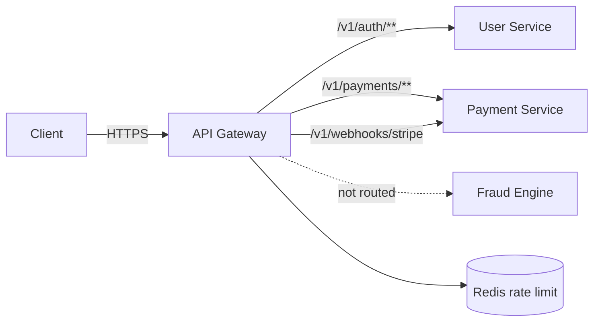

# Implementation Plan: payguard-api-gateway

**Owner:** @bereket-7
**Status:** Mostly complete
**Last updated:** 2026-08-20
**Repo:** github.com/bereket-7/payguard-api-gateway
**Depends on:** Keycloak JWKS, `payguard-user-service`, `payguard-payment-service`, Redis from the local stack

---

## 1. Purpose and boundaries

**Owns:** the edge. The single public entry point — routing, TLS termination, per-merchant-tier rate limiting, JWT pre-validation, request correlation, and CORS.

**Does not own:** business logic, authorization decisions beyond "is this token valid", or data. The gateway must remain stateless and thin; every rule that encodes domain meaning belongs in a service.

The failure mode to design against is scope creep. A gateway that starts making authorization decisions becomes a second, undocumented copy of the platform's security model.

---

## 2. Current state

*(Surveyed 2026-08-20 against the submodule HEAD.)*

**Implemented (M1–M4 largely done):**

- Port **8090** (avoids Kafka UI on 8080)
- Routes: user (`/v1/merchants/**`, `/v1/users/**` → `:8086`), payment (`/v1/payments/**`, `/v1/transactions/**`, `/v1/webhooks/stripe` → `:8082`); `/internal/**` not routed
- Filters: correlation ID, edge protection, merchant context, Redis tier rate limiting
- Auth: reactive Keycloak JWT validation; register + Stripe webhook + health permitAll
- Optional TLS and Zipkin tracing via env; `GatewayRoutingIntegrationTest`; CI + Dockerfile

**Remaining:**

- README may still mention stale user-service URI defaults — trust `application.yml` (`8086`)
- Production edge hardening (M5): stricter TLS defaults, aggregated OpenAPI, deeper resilience tests
- Single integration test; no full load/rate-limit soak in CI

Note: the gateway is WebFlux-based. Filters must stay non-blocking.

---

## 3. Target design

```
src/main/java/com/payguard/gateway/
├── GatewayApplication.java
├── route/
│   └── RouteConfig.java             # or declarative YAML routes
├── filter/
│   ├── CorrelationIdFilter.java     # X-Request-Id generation / propagation
│   ├── JwtPreValidationFilter.java  # signature + expiry only
│   └── MerchantContextFilter.java   # merchant_id → header for rate-limit keying
├── config/
│   ├── SecurityConfig.java          # reactive resource server
│   ├── RateLimitConfig.java         # Redis rate limiter + tier KeyResolver
│   └── CorsConfig.java
└── exception/
    └── GatewayErrorHandler.java     # uniform error envelope
```

Routing table:

- `/v1/auth/**` → user-service, **public** (login cannot require a token)
- `/v1/merchants/**`, `/v1/users/**` → user-service, authenticated
- `/v1/payments/**`, `/v1/transactions/**` → payment-service, authenticated
- `/v1/webhooks/stripe` → payment-service, **public**, signature-verified downstream
- `/internal/**` → **not routed at all**

Fraud Engine is deliberately absent. The architecture diagram shows a gateway edge to it, but ADR-003 establishes that only Payment Service calls it, and exposing a scoring endpoint publicly would let a caller probe the fraud model. Keeping it unrouted is the correct reading.



---

## 4. Milestones

### M1 — Port fix, routes, and correlation

Branch: `feat/gateway-routes-and-port`

- Set `server.port: 8090`, clearing the Kafka UI collision. Document it in the README and the umbrella port table.
- Declare routes for user-service and payment-service with `StripPrefix` where needed.
- `CorrelationIdFilter`: accept an inbound `X-Request-Id` or generate one, propagate downstream, echo it in the response. This is the identifier that makes the Gateway → Payment → Fraud trace required by ADR-003 stitchable.
- Expose `health`, `info`, `metrics`, `prometheus`, and `gateway` on actuator.
- Multi-stage Dockerfile with a non-root user; `.github/workflows/ci.yml` running `mvn verify`.
- Open a companion umbrella PR removing the vestigial `db-api-gateway` service and its volume from the compose file, or documenting why it stays.

**DoD:** the gateway starts alongside the full local stack and proxies a request to a running service with a correlation ID present end to end.

### M2 — JWT pre-validation

Branch: `feat/gateway-jwt-prevalidation`

- Add `spring-boot-starter-oauth2-resource-server` configured reactively.
- Validate **signature, expiry, and issuer only.** Authorization stays in the services, per the architecture doc's model of independent validation. The gateway rejects garbage early; it does not decide what a token is allowed to do.
- Public routes explicitly permitted: `/v1/auth/**`, `/v1/webhooks/stripe`, actuator health.
- Extract `merchant_id` into an internal header for rate-limit keying, and **strip that header from inbound requests** so a client cannot spoof it.
- Uniform error envelope for 401 and 403 that leaks nothing about which check failed.

**DoD:** an expired or tampered token is rejected at the edge with no downstream call; a spoofed merchant header is ignored.

### M3 — Tier-based rate limiting

Branch: `feat/gateway-rate-limiting`

- Add `spring-boot-starter-data-redis-reactive`.
- `RedisRateLimiter` keyed by `merchant_id` from the token, falling back to client IP for public routes.
- `KeyResolver` reading the merchant tier claim, with per-tier `replenishRate` and `burstCapacity` from configuration.
- Return `429` with `Retry-After` and `X-RateLimit-*` headers.
- **Fail open on Redis unavailability.** A rate limiter that takes down the platform when its cache is down is worse than no rate limiter. Log and count the degradation.

**DoD:** exceeding a tier's burst returns 429 with correct headers; with Redis stopped, traffic still flows and a degradation counter increments.

### M4 — Resilience and observability

Branch: `feat/gateway-resilience-observability`

- Per-route timeouts and retries: retry only idempotent `GET`s, never `POST /v1/payments`.
- Circuit breakers per downstream route so one failing service does not exhaust connections for others.
- `micrometer-tracing-bridge-brave` plus `zipkin-reporter-brave` to originate the distributed trace.
- Prometheus metrics per route: latency, status distribution, rate-limit rejections.
- CORS from an explicit allow-list, never a wildcard with credentials.

**DoD:** a downstream outage produces fast 503s rather than hanging requests, and a full trace spans gateway through fraud engine.

### M5 — Production edge

Branch: `feat/gateway-production-edge`

- TLS termination configuration (ALB or in-gateway, decided with `payguard-infrastructure`).
- Request size limits and header count limits.
- Security headers: HSTS, `X-Content-Type-Options`, `X-Frame-Options`, referrer policy.
- Optional aggregated OpenAPI view over the services' springdoc endpoints.

**DoD:** a security header scan passes; oversized payloads are rejected at the edge.

---

## 5. Interfaces and contracts

The gateway defines the **public** API surface — the only URLs a client should know. Its contract is the routing table above plus these guarantees:

- Every response carries `X-Request-Id`.
- Rate-limited responses are `429` with `Retry-After`.
- Auth failures are `401` with a uniform envelope; authorization failures come from services as `403`.
- `/internal/**` is never reachable from outside the cluster.

No Kafka involvement. The gateway is stateless and has no database.

---

## 6. Data model and migrations

None, deliberately. The only state is rate-limit counters in Redis, which are ephemeral by design. The `db-api-gateway` Postgres in the local stack should be removed unless a use case is documented — see M1.

---

## 7. Configuration

- Port **8090** (changed from the implicit 8080)
- `SPRING_DATA_REDIS_HOST` / `SPRING_DATA_REDIS_PORT` — shared with Fraud Engine locally; separate instances or at least separate databases in production, since fraud feature lookups are latency-critical and must not contend with edge traffic
- Downstream base URLs: user-service `http://localhost:8086`, payment-service `http://localhost:8082`
- New: `payguard.ratelimit.tiers.<tier>.replenish-rate`, `.burst-capacity`, `payguard.cors.allowed-origins`

---

## 8. Testing strategy

- **Unit:** `KeyResolver` tier mapping, correlation ID generation and propagation, inbound header stripping.
- **Integration:** `WebTestClient` against WireMock backends for routing, prefix stripping, and error mapping.
- **Rate limiting (Testcontainers Redis):** burst exhaustion returns 429; separate merchants have independent buckets; Redis down fails open.
- **Security:** expired, tampered, and missing tokens; spoofed merchant header; public routes reachable without a token; `/internal/**` unreachable.
- **Resilience:** downstream returning 500 or hanging; assert the breaker opens and requests fail fast.

---

## 9. Observability and SLOs

SLO: gateway overhead under **10ms** at p99, excluding downstream time. The gateway is on every request path, so its own latency is a platform-wide tax.

Metrics: `gateway.request.latency` by route and status, `gateway.ratelimit.rejected` by tier, `gateway.auth.rejected` by reason, `gateway.circuitbreaker.state` by route, `gateway.redis.degraded`.

The gateway originates every trace, so a missing or broken correlation ID here blinds the whole platform — worth alerting on trace-completeness rather than assuming it works.

---

## 10. Security

- Only public entry point, so TLS terminates here and everything behind it is cluster-internal.
- JWT signature, expiry, and issuer checked at the edge; authorization stays in services.
- Client-supplied internal headers stripped, preventing merchant-context spoofing.
- `/internal/**` unrouted, enforced additionally by `NetworkPolicy` in `payguard-infrastructure`.
- Fraud Engine unreachable from outside, so the model cannot be probed.
- CORS allow-list, security headers, request size caps.
- Rate limiting is a security control as much as a capacity one; keep the fail-open decision explicit and monitored.

---

## 11. Risks and open questions

- **The vestigial `db-api-gateway` Postgres** should be removed or justified. Leaving it invites someone to make the gateway stateful.
- **Redis is shared** between edge rate limiting and fraud feature lookups in the local stack. In production this is a real contention risk against the 200ms budget — `payguard-infrastructure` should provision separate ElastiCache instances or clearly separated databases.
- **Fail-open rate limiting** is the right default but is a deliberate accepted risk: a Redis outage removes abuse protection. Alert on it.
- **Fraud Engine route** contradicts the architecture diagram, which shows a gateway edge into it. This plan treats that as a diagram simplification; confirm and update the diagram rather than adding the route.
- **TLS termination location** (ALB versus gateway) is an infrastructure decision that affects this repo's configuration.
- **Port changes** to 8090 here and 8086 for user-service must land together with the umbrella documentation updates.

---

## 12. Definition of done

- One public entry point serving all client traffic with no port collisions locally.
- Invalid tokens rejected at the edge; authorization left to services.
- Per-tier rate limiting that fails open, with visibility when it does.
- Every request carries a correlation ID that stitches a full trace through to the fraud call.
- Fraud Engine and all `/internal/**` paths are unreachable from outside the cluster.
