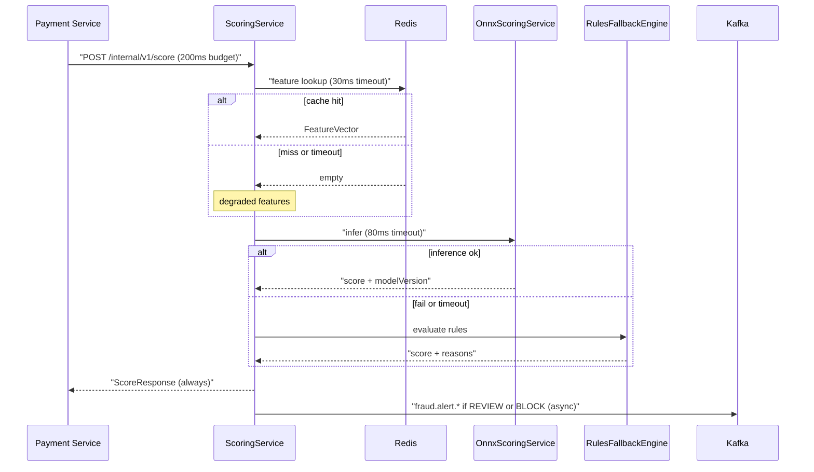

# Implementation Plan: payguard-fraud-engine

**Owner:** @bereket-7
**Status:** Draft
**Last updated:** 2026-07-29
**Repo:** github.com/bereket-7/payguard-fraud-engine
**Depends on:** `payguard-event-schemas` (M3), Redis and Kafka from the local stack, `payguard-fraud-model-training` for the ONNX artifact (M4 only)

---

## 1. Purpose and boundaries

**Owns:** the risk decision. Given a transaction, return a score and one of `APPROVE`, `REVIEW`, `BLOCK` within the 200ms budget set by [ADR-003](../adr/ADR-003-sync-payment-to-fraud-engine.md), and publish an alert when the decision is not a clean approve.

**Does not own:** creating charges, holding transactions, notifying merchants, or training the model. It answers one question and emits one event.

This is the only service that is called synchronously by another service, and the only one that loads a machine learning model. Both facts make latency the dominant design constraint — every decision below trades functionality for predictability.

---

## 2. Current state

Almost nothing is implemented:

- [`FraudEngineApplication.java`](../../services/payguard-fraud-engine/src/main/java/com/payguard/fraud/FraudEngineApplication.java) — a one-line `@SpringBootApplication`.
- [`RulesFallbackEngine.java`](../../services/payguard-fraud-engine/src/main/java/com/payguard/fraud/scoring/RulesFallbackEngine.java) — an empty `final` class with a private constructor. The Javadoc states its intent ("Conservative fallback used when model inference cannot complete in budget") but there is no logic.
- [`application.yml`](../../services/payguard-fraud-engine/src/main/resources/application.yml) — sets the app name, `server.port: 8083`, and `payguard.model-uri` defaulting to `s3://payguard-models/fraud/current.onnx`.
- `pom.xml` — Spring Boot 3.4.3, Java 17, and only `web`, `actuator`, `test`. No `onnxruntime`, no Redis, no Kafka, no JPA.
- `Dockerfile` — single stage, `eclipse-temurin:17-jre`, copies `target/fraud-engine-*.jar`, runs as root.

Not present, though the architecture doc lists them: `OnnxScoringService`, `ScoreController`, `FeatureCacheClient`, and `src/main/resources/models/fraud-model-v3.onnx`.

Consequential detail: [`docs/runbooks/fraud-engine-degraded.md`](../runbooks/fraud-engine-degraded.md) already tells an on-call engineer to curl `/actuator/metrics/resilience4j.circuitbreaker.state` and to expect `OrtException` in the logs. The runbook is ahead of the code, so M1 and M4 should make those instructions true.

---

## 3. Target design

```
src/main/java/com/payguard/fraud/
├── FraudEngineApplication.java
├── config/
│   ├── RedisConfig.java             # Lettuce, explicit timeouts
│   ├── KafkaConfig.java             # Avro producer, merchant_id as key
│   └── SecurityConfig.java          # JWT resource server; service-to-service only
├── controller/
│   └── ScoreController.java         # POST /internal/v1/score
├── domain/
│   ├── ScoreRequest.java            # record
│   ├── ScoreResponse.java           # record: score, decision, reasons, modelVersion, engine
│   ├── Decision.java                # enum APPROVE / REVIEW / BLOCK
│   └── ScoredTransaction.java       # JPA entity — audit trail
├── scoring/
│   ├── ScoringService.java          # orchestrates: features → model → fallback
│   ├── OnnxScoringService.java      # ONNX Runtime inference
│   ├── RulesFallbackEngine.java     # deterministic rules
│   ├── FeatureCacheClient.java      # Redis feature lookup
│   └── FeatureVector.java           # must match the training contract
├── event/
│   └── FraudAlertProducer.java      # fraud.alert.high / .medium
└── repository/
    └── ScoredTransactionRepository.java
```

Request path, with the timeout budget made explicit:



Two design rules follow from the SLA:

1. **The response is never an error.** A failure inside the engine degrades the answer, it does not become a 5xx. Payment Service has its own circuit breaker, but this service should not need it to be exercised for a Redis blip.
2. **Kafka publishing is off the critical path.** The alert is published after the response is committed, never before it.

---

## 4. Milestones

### M1 — Rules-only decision path

Branch: `feat/fraud-engine-rules-scoring`

Ship a working decision before any ML. This unblocks the payment-service integration immediately and satisfies the non-negotiable fallback requirement from [ADR-002](../adr/ADR-002-python-trains-java-serves.md) on day one rather than last.

- Add dependencies: `spring-boot-starter-validation`, `micrometer-registry-prometheus`.
- Implement `Decision`, `ScoreRequest`, `ScoreResponse`, `ScoringService`.
- Implement `RulesFallbackEngine` with documented, deterministic thresholds — high amount, unknown merchant, missing features. Each triggered rule appends a human-readable string to `reasons`, because that array is what the merchant sees in the alert.
- Implement `ScoreController` at `POST /internal/v1/score`.
- Expose `health`, `info`, `metrics`, `prometheus` on actuator.
- Multi-stage Dockerfile with a non-root user.
- Add `.github/workflows/ci.yml` running `mvn verify`.

**DoD:** `curl` against a locally running service returns a decision in single-digit milliseconds; unit tests cover every rule branch and the boundary values.

### M2 — Redis feature cache

Branch: `feat/fraud-engine-redis-features`

- Add `spring-boot-starter-data-redis`.
- `FeatureCacheClient` reads a per-merchant feature hash at key `fraud:features:{merchant_id}`, with a **30ms** command timeout and no retry. A slow cache must not consume the inference budget.
- Cache miss and cache timeout are the same case: proceed with a degraded `FeatureVector` and record a `fraud.features.degraded` counter.
- Testcontainers Redis integration test covering hit, miss, and a forced timeout.

**DoD:** with Redis stopped, the service still returns decisions and the degraded counter increments.

### M3 — Persistence and audit trail

Branch: `feat/fraud-engine-audit-persistence`

- Add `spring-boot-starter-data-jpa`, `postgresql`, `flyway-core`.
- `ScoredTransaction` entity: `transaction_id`, `merchant_id`, `score`, `decision`, `reasons`, `model_version`, `engine` (`ONNX` or `RULES`), `scored_at`, `latency_ms`.
- Flyway `V1__scored_transaction.sql`, indexed on `(merchant_id, scored_at)`.
- Persist **asynchronously** after the response is returned. Audit durability must not be paid for inside the 200ms budget.

**DoD:** every scored transaction appears in Postgres with the engine that produced it; Testcontainers Postgres test passes.

### M4 — ONNX inference

Branch: `feat/fraud-engine-onnx-scoring`

- Add `com.microsoft.onnxruntime:onnxruntime` per ADR-002.
- `OnnxScoringService` loads the model from `payguard.model-uri` (`s3://` in production, `classpath:` or `file:` locally), holding one `OrtSession` for the process lifetime — session creation is far too slow to do per request.
- Hard **80ms** inference timeout on a bounded executor; on timeout or `OrtException`, fall through to `RulesFallbackEngine` and increment `fraud.model.fallback`.
- `FeatureVector` field order must match `FEATURE_COLUMNS` in [`feature_pipeline.py`](../../services/payguard-fraud-model-training/src/features/feature_pipeline.py) — currently `amount_minor`, `merchant_velocity_1h`, `device_risk_score`. Assert this in a test with the column list duplicated as a literal, so a training-side reorder fails the build instead of silently skewing scores.
- Tag every `ScoreResponse` and audit row with `model_version`, which ADR-002 requires for rollback.
- Log `OrtException` at ERROR with the model URI, matching Scenario A of the degraded runbook.

**DoD:** with a real ONNX artifact present, decisions come from the model and report their version; with the artifact deleted, the service starts and serves rules-based decisions.

### M5 — Alert publishing

Branch: `feat/fraud-engine-alert-producer`

- Add `spring-kafka` and the `event-schemas` artifact.
- `FraudAlertProducer` publishes `FraudAlert` to `fraud.alert.high` when `BLOCK`, `fraud.alert.medium` when `REVIEW`, keyed by `merchant_id`. Nothing is published for `APPROVE`.
- Publish after the response, with failures logged and counted rather than propagated.
- Testcontainers Kafka test asserting topic routing and key.

**DoD:** a blocked transaction produces exactly one message on `fraud.alert.high` with a populated `reasons` array.

### M6 — Model hot reload

Branch: `feat/fraud-engine-model-hot-reload`

ADR-002 lists hot reload as an accepted consequence to solve. Deferred until the training pipeline actually publishes new versions.

- `POST /internal/v1/model/reload` (admin-scoped) swaps in a new `OrtSession` atomically, keeping the old one serving until the new one is warm.
- Reject a model whose input arity does not match `FeatureVector`.

**DoD:** a new model version is served without a restart and without a failed request.

---

## 5. Interfaces and contracts

### Provided

`POST /internal/v1/score` — private, never routed through the API Gateway.

Request:

```json
{
  "transaction_id": "txn_01H...",
  "merchant_id": "mer_123",
  "amount_minor": 4999,
  "currency": "USD",
  "device_fingerprint": "df_abc",
  "ip_address": "203.0.113.7"
}
```

Response:

```json
{
  "transaction_id": "txn_01H...",
  "score": 87.4,
  "decision": "BLOCK",
  "reasons": ["amount above merchant 30d p99", "device seen on 4 merchants in 1h"],
  "model_version": "fraud-model-v3",
  "engine": "ONNX"
}
```

`engine` is part of the contract on purpose: the caller and the audit trail both need to know whether a decision came from the model or the fallback.

### Produced

- `fraud.alert.high` — `FraudAlert`, key `merchant_id`
- `fraud.alert.medium` — `FraudAlert`, key `merchant_id`

### Consumed

No Kafka consumption. Redis is populated by an out-of-band feature job, which does not exist yet — see risks.

---

## 6. Data model and migrations

Single table, `scored_transaction`, in `payguard_fraud` (local port 5435). Flyway from `V1`. Every row carries `merchant_id` for tenant scoping. Retention is an open question — scoring rows are audit records and likely need a longer horizon than operational data, so partition by month before volume forces a rewrite.

---

## 7. Configuration

- Port **8083** (already set, no conflict with the local stack)
- `SPRING_DATASOURCE_URL=jdbc:postgresql://localhost:5435/payguard_fraud`
- `SPRING_DATA_REDIS_HOST` / `SPRING_DATA_REDIS_PORT`
- `SPRING_KAFKA_BOOTSTRAP_SERVERS`, `SPRING_KAFKA_PROPERTIES_SCHEMA_REGISTRY_URL`
- `PAYGUARD_MODEL_URI` — already wired to `payguard.model-uri`
- New keys to add: `payguard.timeout.feature-ms: 30`, `payguard.timeout.inference-ms: 80`, `payguard.rules.*` thresholds

Timeouts belong in configuration, not constants, because the 200ms budget is a platform SLA that gets tuned under load.

---

## 8. Testing strategy

- **Unit (JUnit 5 + Mockito):** every rule branch; decision boundaries at each threshold; fallback triggered by injected `OrtException` and by injected timeout; feature-order assertion.
- **Integration (Testcontainers):** Redis hit/miss/timeout; Postgres audit write; Kafka topic routing.
- **Degradation tests, treated as first-class:** Redis down, model file absent, model corrupt, Kafka down. Each must still yield a decision. These encode the SLA and should fail the build if broken.
- **Latency guard:** an assertion that a rules-only decision completes well inside budget on CI hardware. Keep the bound loose enough not to flake, tight enough to catch a regression like per-request session creation.

---

## 9. Observability and SLOs

SLO: p99 of `POST /internal/v1/score` under **150ms**, leaving headroom inside the 200ms caller timeout. This is the threshold the degraded runbook alerts on.

Metrics: `fraud.score.latency` (histogram, tagged by engine), `fraud.decision.count` (tagged by decision), `fraud.model.fallback`, `fraud.features.degraded`, `fraud.model.version` (gauge/info).

Tracing must cover the Gateway → Payment → Fraud hop as ADR-003 requires, with spans around the Redis lookup and the inference call so an incident can be attributed to one of them rather than to "the fraud engine".

---

## 10. Security

- Not exposed through the gateway. The `/internal/**` prefix is a reminder, not a control — the control is a `NetworkPolicy` in `payguard-infrastructure` plus mTLS for the Payment → Fraud hop per ADR-003.
- JWT validated independently, as every service does.
- `merchant_id` scopes every query and every cache key.
- The request carries no card data — only amounts, identifiers, and device signals.
- Model artifacts come from S3 over an IAM role, never a baked-in credential.

---

## 11. Risks and open questions

- **Nothing populates Redis.** The architecture doc describes velocity and device-reputation features in the cache, but no component computes them. Options: a Kafka Streams job over `payment.*`, a scheduled job in this service, or a separate feature service. Needs a decision before M4 has anything meaningful to infer over. Likely **ADR-005**.
- **Feature contract drift** between Python training and Java serving is the highest-severity silent failure mode in the platform: it produces plausible scores that are wrong. The literal-list assertion in M4 is a stopgap; generating `FeatureVector` from a versioned contract file shared with the training repo is the real fix.
- **Cold start.** `OrtSession` creation plus JIT warm-up means the first requests after a deploy are slow. Needs a readiness gate that only reports ready after a synthetic inference succeeds.
- **`REVIEW` has no consumer.** The engine publishes a medium alert, but "holding" a transaction is payment-service behaviour and no queue or dashboard exists to action it. Coordinate with the [payment-service plan](payguard-payment-service.md).

---

## 12. Definition of done

- A decision is returned for every request, under 150ms at p99, with Redis, the model, or Kafka individually broken.
- Every decision is auditable: score, decision, reasons, engine, model version, latency.
- Alerts land on the correct severity topic keyed by `merchant_id`.
- The instructions in `fraud-engine-degraded.md` are all executable against the real service.
