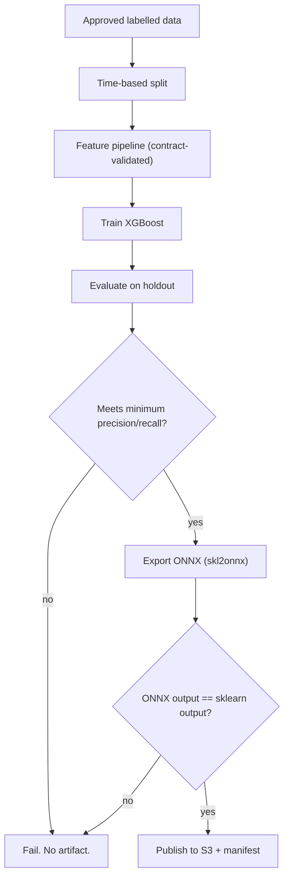

# Implementation Plan: payguard-fraud-model-training

**Owner:** @bereket-7
**Status:** In progress
**Last updated:** 2026-08-20
**Repo:** github.com/bereket-7/payguard-fraud-model-training
**Depends on:** an approved labelled dataset (still the blocker for real promotion), S3 model registry from `payguard-infrastructure`

---

## 1. Purpose and boundaries

**Owns:** the offline model lifecycle. Feature definitions, training, evaluation, threshold selection, ONNX export, and publication of a versioned artifact to the S3 model registry.

**Does not own:** serving. [ADR-002](../adr/ADR-002-python-trains-java-serves.md) places the boundary at the ONNX artifact — Python stops at the file in S3, and the JVM takes over from there.

The most important thing this repo produces is not a model, it is a **contract**: the ordered feature vector that `payguard-fraud-engine` must construct identically at serving time. Getting that wrong produces plausible-looking scores that are quietly wrong, which is the single worst failure mode in the platform.

---

## 2. Current state

*(Surveyed 2026-08-20 against the submodule HEAD.)*

**Implemented (M1–M5 largely coded; M6 partial):**

- Pinned `requirements.txt` / `requirements-dev.txt`, `pyproject.toml`, CI (ruff, mypy, pytest)
- Feature contract: `contracts/feature-contract-v1.json` + `src/features/`; umbrella gate `scripts/verify-ml-contract.sh`
- Training / evaluate / export pipeline: `train_xgboost.py`, `evaluate.py`, `export_onnx.py` with unit tests (`test_features`, `test_export_onnx`)
- `publish.py` copies ONNX + manifest to a **local** registry directory (`current.onnx`)

**Remaining:**

- No S3 model-registry publish / promotion workflow (infra has the bucket module; training does not call AWS)
- Approved labelled production dataset still a governance blocker
- ONNX JVM parity test in fraud-engine CI still optional follow-up
- Feature pipeline remains thin relative to a full feature store

---

## 3. Target design

```
payguard-fraud-model-training/
├── requirements.txt              # == pins
├── requirements-dev.txt          # pytest, ruff, mypy
├── pyproject.toml                # tool config, 120-char line length
├── contracts/
│   └── feature-contract-v1.json  # THE cross-language contract
├── notebooks/
│   └── exploration.ipynb
├── src/
│   ├── data/
│   │   ├── loader.py             # approved source only
│   │   └── splitter.py           # time-based, not random
│   ├── features/
│   │   ├── feature_pipeline.py   # transformations
│   │   └── contract.py           # load + validate the contract
│   ├── training/
│   │   ├── train_xgboost.py
│   │   └── evaluate.py
│   ├── export/
│   │   ├── export_onnx.py
│   │   └── publish.py            # S3 upload + manifest
│   └── registry/
│       └── manifest.py           # version, metrics, feature hash
└── tests/
```

The promotion gate, which is what ADR-002 requires ("metrics must be recorded before any artifact is promoted"):



Two gates are non-negotiable. **Metric thresholds** stop a bad model from shipping. **Numerical parity** between the Python model and the exported ONNX graph stops a correct model from shipping broken — export bugs are silent and produce a model that scores differently in production than in evaluation.

---

## 4. Milestones

### M1 — Reproducible foundation

Branch: `chore/training-reproducible-setup`

Small, mechanical, and unblocks everything else.

- Convert `requirements.txt` to `==` pins as `CONTRIBUTING.md` requires; add `requirements-dev.txt` with `pytest`, `ruff`, and `mypy`.
- Add `pyproject.toml` with a 120-character line length and strict type checking, matching the Python style rules.
- Add `__init__.py` to `src/data`, `src/features`, `src/training`, `src/export`, `src/registry`.
- Add `.github/workflows/ci.yml`: install, `ruff`, `mypy`, `pytest`.
- Add `notebooks/` with a `.gitkeep` and a README note that notebooks are for exploration only and never for production paths.

**DoD:** CI is green; a fresh `pip install -r requirements.txt` produces an identical environment twice.

### M2 — Feature contract as a first-class artifact

Branch: `feat/training-feature-contract`

This is the milestone that prevents the platform's worst silent failure.

- Add `contracts/feature-contract-v1.json`: an ordered list of features, each with name, dtype, an allowed range or category set, and a default for missing values. Include a `contract_version` and a stable hash.
- `src/features/contract.py` loads it, and `FEATURE_COLUMNS` is **derived from** it rather than hand-maintained.
- Validation: any dataframe passed to training or export must match the contract in column order and dtype, or the run fails.
- Publish the contract alongside the model artifact so the serving side can verify the exact contract a model was trained against.
- Coordinate with the [fraud-engine plan](payguard-fraud-engine.md) M4 so `FeatureVector` is generated from or checked against this file.

**DoD:** reordering two features fails the build on both the Python and Java sides.

### M3 — Data loading and honest splitting

Branch: `feat/training-data-pipeline`

- `src/data/loader.py` reading only from an approved, configured source. Keep the current refusal-to-run behaviour when unconfigured — an accidental default pointing at production data is a far worse outcome than an inconvenient error.
- **Time-based splitting**, never random. Fraud is temporally correlated and adversarial; a random split leaks future information and produces optimistic metrics that will not survive production.
- Class imbalance handled explicitly via `scale_pos_weight` or deliberate sampling, with the choice recorded in the manifest.
- Never persist raw transaction data in the repo or in CI artifacts.

**DoD:** a documented synthetic fixture trains end to end; splits are chronological and non-overlapping.

### M4 — Training and evaluation gates

Branch: `feat/training-xgboost-and-evaluation`

- Replace the scaffold `main()` in `train_xgboost.py` with a real pipeline: config-driven hyperparameters, a fixed random seed, and a training log.
- `evaluate.py` computing precision, recall, F1, PR-AUC, and ROC-AUC on the holdout, plus a confusion matrix at the selected threshold. ADR-002 explicitly requires these to be recorded before promotion.
- **Threshold selection is a business decision**, so surface the precision-recall trade-off rather than hard-coding a default. The three-way `APPROVE`/`REVIEW`/`BLOCK` split needs two thresholds, and where they sit determines how much manual review the merchant absorbs.
- Fail the run if metrics fall below configured minimums.
- Emit a metrics JSON alongside the model.

**DoD:** a training run produces metrics and refuses to proceed when they are below threshold; results are reproducible from the seed.

### M5 — ONNX export with parity verification

Branch: `feat/training-onnx-export`

- Implement `export_onnx.py` using `skl2onnx`, with input shape derived from the contract.
- **Parity test:** score a holdout sample through both the Python model and the ONNX graph via `onnxruntime`, and assert agreement within a tight tolerance. Fail the export on mismatch. This is the check that catches the export bugs ADR-002 acknowledges as a risk.
- Embed metadata in the ONNX model: version, training date, contract hash, dataset identifier.

**DoD:** the exported artifact loads in `onnxruntime` and produces numerically equivalent scores; a deliberately broken export fails CI.

### M6 — Model registry publication

Branch: `feat/training-model-registry-publish`

- `publish.py` uploading to `s3://payguard-models/fraud/<version>/` with `model.onnx`, `metrics.json`, `feature-contract.json`, and `manifest.json`.
- `current.onnx` promotion is a **separate, explicit step**, since that path is what [`fraud-engine/application.yml`](../../services/payguard-fraud-engine/src/main/resources/application.yml) loads by default via `payguard.model-uri`. Training should never silently change what production serves.
- Manifest records version, git SHA, dataset ID, metrics, contract hash, and who promoted it — the audit trail ADR-002 requires for rollback.
- Versions are immutable; rollback is repointing `current`, never overwriting a version.
- GitHub Actions workflow for training and publishing on dispatch, with OIDC to assume an AWS role rather than long-lived keys.

**DoD:** a published version is retrievable and loadable by the fraud engine; promotion is a deliberate action with an audit record; rollback is a one-step repoint.

---

## 5. Interfaces and contracts

The only runtime interface is the S3 layout:

```
s3://payguard-models/fraud/
├── current.onnx                  # what production serves
└── v3/
    ├── model.onnx
    ├── metrics.json
    ├── feature-contract.json
    └── manifest.json
```

The feature contract is the cross-language interface. Its consumer is `FeatureVector` in the fraud engine, and its ordering must match exactly. Everything in M2 exists to make that mechanical rather than trusted.

No REST API, no Kafka. This repo runs offline.

---

## 6. Data model and migrations

No database. The dataset is external and read-only; the artifact store is versioned and immutable. "Migration" means a contract version bump, which requires a retrain and a coordinated fraud-engine release.

---

## 7. Configuration

Environment-driven, with no defaults that could point at real data:

- `PAYGUARD_TRAINING_DATA_URI` — approved source; unset means refuse to run
- `PAYGUARD_MODEL_REGISTRY_BUCKET`
- `AWS_REGION` and OIDC-assumed role credentials
- `PAYGUARD_MIN_PRECISION`, `PAYGUARD_MIN_RECALL` — promotion gates
- `PAYGUARD_RANDOM_SEED`

---

## 8. Testing strategy

- **Unit (pytest):** contract loading and validation; feature transformations against fixtures; chronological split correctness; threshold selection; manifest construction.
- **Contract tests:** column order and dtype enforcement; contract hash stability.
- **Export parity:** the highest-value test in the repo — sklearn versus ONNX agreement on a holdout sample.
- **Reproducibility:** two runs with the same seed and data produce identical metrics.
- **Negative tests:** unconfigured data source refuses to run; below-threshold metrics block export; contract mismatch fails.
- **Data hygiene:** no test may commit or cache real transaction data.

Extend the existing `test_features.py` rather than replacing it — its assertion that the feature contract is non-empty is a reasonable smoke test to keep.

---

## 9. Observability and SLOs

Offline, so no runtime SLO. What matters is the record of each run: training duration, dataset size and date range, metrics, contract hash, and git SHA, all captured in the manifest.

The production-facing signal lives in the fraud engine: if `fraud.model.fallback` rises after a promotion, the newly promoted model is the first suspect, and the manifest is what makes the rollback decision fast.

---

## 10. Security

- **No production credentials or payment data in this repo** — the README already states this and it should stay enforced by review and by the loader's refusal to default.
- Training data is real transaction data, so it must never be committed, cached in CI artifacts, or copied into a notebook that gets checked in.
- Notebooks must have outputs stripped before commit; an output cell is an easy way to leak rows of real data.
- S3 publication via OIDC-assumed roles, never static keys.
- The model artifact itself is sensitive: it encodes fraud detection logic, so the bucket should not be public and the fraud engine should read it via an IAM role.
- Consider fairness review before promotion — a fraud model that systematically blocks a category of legitimate merchants is a business and compliance risk, not just a metrics regression.

---

## 11. Risks and open questions

- **No approved dataset exists.** This is the hard blocker, and it is a data-governance decision about which data may be used for training and under what retention. M3 cannot complete without it.
- **Nothing computes serving features.** `merchant_velocity_1h` and `device_risk_score` must be available in Redis at scoring time, and no component produces them. Training a model on features that cannot be served in production would waste the entire pipeline. This is the same gap raised in the [fraud-engine plan](payguard-fraud-engine.md) and needs an ADR before M4.
- **Training/serving skew** is the systemic risk: features computed by pandas offline and by Java online will diverge unless the transformations are specified precisely in the contract. Consider generating both sides from the contract.
- **Three features is a thin model.** `FEATURE_COLUMNS` has three entries; a production fraud model typically uses far more. Expanding it is constrained by what can be served within the latency budget, so feature selection is a joint decision with the fraud engine.
- **Label availability and delay.** Fraud labels arrive via chargebacks weeks later. Retraining cadence must account for that lag, and recent data is effectively unlabelled.
- **`current.onnx` promotion is a production change** made from this repo. It should require the same review discipline as a deploy, not a convenience script.

---

## 12. Definition of done

- A training run is reproducible from a pinned environment and a fixed seed.
- The feature contract is a versioned artifact, and a mismatch fails the build on both the Python and Java sides.
- Metrics are recorded and gate promotion, as ADR-002 requires.
- ONNX export is verified numerically equivalent to the Python model.
- Every published version carries a manifest sufficient to audit and roll back the decision to promote it.
- No real transaction data or credential ever lands in the repository.
