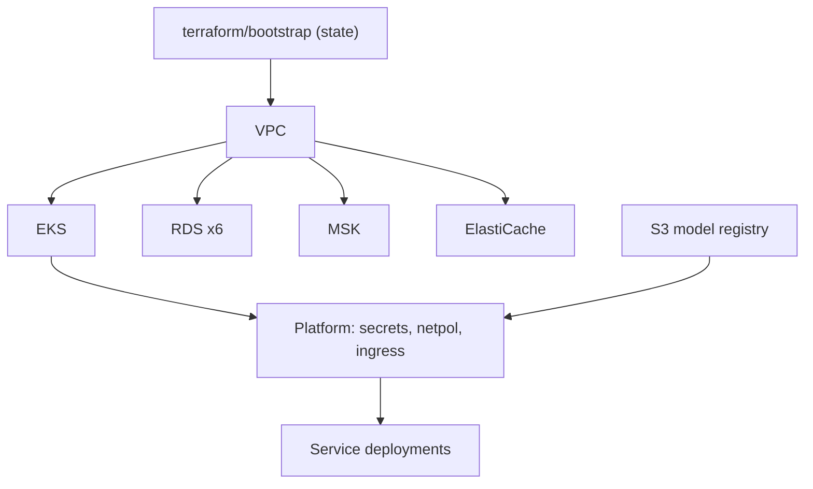

# Implementation Plan: payguard-infrastructure

**Owner:** @bereket-7
**Status:** Draft
**Last updated:** 2026-07-29
**Repo:** github.com/bereket-7/payguard-infrastructure
**Depends on:** an AWS account with an agreed region and account structure — currently the blocker for everything past M1

---

## 1. Purpose and boundaries

**Owns:** everything that exists before an application can run. Terraform for the AWS footprint (EKS, RDS, MSK, ElastiCache, S3), Kubernetes manifests, network policy, secrets plumbing, and the deployment pipelines.

**Does not own:** application code, application configuration values, or CI for the services themselves.

This repo is the only deploy blocker in the platform: every other plan can reach "works locally" without it, and none can reach production. It is also the repo where a mistake is most expensive, since Terraform mistakes are stateful.

---

## 2. Current state

Structure is laid out correctly; content is almost entirely placeholders.

- [`terraform/eks/main.tf`](../../services/payguard-infrastructure/terraform/eks/main.tf) — a `terraform { required_version = ">= 1.8.0" }` block plus a comment noting EKS resources come after account, VPC, and remote-state configuration. That sequencing note is right.
- [`terraform/eks/variables.tf`](../../services/payguard-infrastructure/terraform/eks/variables.tf) — two variables, and the second is **likely invalid HCL**:

```hcl
variable "region" { type = string, default = "us-east-1" }
```

  HCL requires a newline between arguments inside a block, not a comma. Since [`terraform-plan.yml`](../../services/payguard-infrastructure/.github/workflows/terraform-plan.yml) runs `terraform validate` against this module, CI should already be failing. Verify first — if it passes, the assumption is wrong and nothing needs changing.

- [`terraform/rds/main.tf`](../../services/payguard-infrastructure/terraform/rds/main.tf), [`msk/main.tf`](../../services/payguard-infrastructure/terraform/msk/main.tf), [`elasticache/main.tf`](../../services/payguard-infrastructure/terraform/elasticache/main.tf) — single comment lines, no resources. There is no `s3` module at all, though the architecture doc and ADR-002 both require an S3 model registry.
- [`k8s/base/deployment.yml`](../../services/payguard-infrastructure/k8s/base/deployment.yml) — one generic `payguard-service` Deployment: 2 replicas, `image: REPLACE_AT_DEPLOY`, a readiness probe on `/actuator/health`. No resource requests or limits, no liveness probe, no `securityContext`, and only an `app` label where `CONTRIBUTING.md` requires `app`, `component`, and `version`.
- [`k8s/base/service.yml`](../../services/payguard-infrastructure/k8s/base/service.yml) — matching generic Service.
- [`k8s/overlays/prod/kustomization.yml`](../../services/payguard-infrastructure/k8s/overlays/prod/kustomization.yml) — references `../../base` and nothing else. No per-service overlays, no image tags, no environment differentiation.
- [`terraform-plan.yml`](../../services/payguard-infrastructure/.github/workflows/terraform-plan.yml) — `init -backend=false` and `validate`, **only for the `eks` module**. The other three are unvalidated.
- [`terraform-apply.yml`](../../services/payguard-infrastructure/.github/workflows/terraform-apply.yml) — `workflow_dispatch` with a production environment gate, and a step that just echoes "Configure remote state and apply approval before enabling this workflow." Honest, and correctly disabled.

Also missing platform-wide: no remote state backend, no VPC module, no Schema Registry (MSK does not include one, and every service is configured with `SPRING_KAFKA_PROPERTIES_SCHEMA_REGISTRY_URL`), no `NetworkPolicy`, no HPA, no secrets integration, no ingress or TLS.

---

## 3. Target design

```
payguard-infrastructure/
├── terraform/
│   ├── bootstrap/            # state bucket + DynamoDB lock (run once, local state)
│   ├── modules/
│   │   ├── vpc/
│   │   ├── eks/
│   │   ├── rds/              # reusable: one invocation per service DB
│   │   ├── msk/
│   │   ├── elasticache/
│   │   ├── s3-model-registry/
│   │   └── irsa/             # IAM roles for service accounts
│   └── envs/
│       ├── dev/
│       └── prod/
├── k8s/
│   ├── base/                 # per-service, not one generic manifest
│   │   ├── api-gateway/
│   │   ├── user-service/
│   │   ├── payment-service/
│   │   ├── fraud-engine/
│   │   ├── notification-service/
│   │   └── reconciliation-service/
│   ├── platform/
│   │   ├── network-policies/
│   │   ├── external-secrets/
│   │   └── ingress/
│   └── overlays/
│       ├── dev/
│       └── prod/
└── .github/workflows/
```

Two structural corrections to the current layout:

- **Terraform moves from per-resource directories to modules plus environments.** `terraform/rds/main.tf` as a single root module cannot express six per-service databases across two environments. A reusable module invoked per service can.
- **Kubernetes moves from one generic manifest to per-service bases.** The services genuinely differ: Fraud Engine needs a model volume and aggressive HPA, Payment Service needs Stripe secrets, the consumers need replica counts bounded by partition count. A single `payguard-service` manifest cannot express that.



---

## 4. Milestones

### M1 — Fix CI and validate everything

Branch: `fix/terraform-validate-all-modules`

Smallest possible first step, and it makes the pipeline trustworthy before anything is provisioned.

- Verify whether `terraform validate` currently fails on `variables.tf`. If it does, split the arguments onto separate lines:

```hcl
variable "region" {
  type    = string
  default = "us-east-1"
}
```

- Extend `terraform-plan.yml` to run `fmt -check`, `init -backend=false`, and `validate` across **every** module via a matrix, so a new module cannot be added unvalidated.
- Add `tflint` and a security scanner such as `tfsec` or `checkov` to the PR workflow.

**DoD:** CI is green and covers every module; a malformed or insecure resource fails a PR.

### M2 — Remote state and network foundation

Branch: `feat/terraform-state-and-vpc`

- `terraform/bootstrap`: versioned, encrypted state bucket plus a DynamoDB lock table, applied once with local state and then documented as never re-run casually.
- `modules/vpc`: three availability zones, public subnets for load balancers, private subnets for nodes, isolated subnets for data, NAT, and VPC flow logs.
- `envs/dev` and `envs/prod` wiring the backend and the VPC module.
- Every resource tagged `Name` and `managed-by = "terraform"`, as `CONTRIBUTING.md` requires, plus `environment` and `service`.

**DoD:** `terraform plan` in `envs/dev` is clean against remote state; state is locked and encrypted.

### M3 — Kubernetes manifests that match the services

Branch: `feat/k8s-per-service-manifests`

Deliverable is a working local `kustomize build`, independent of any AWS account, so it can land before M2 completes.

- Replace the generic base with six per-service bases, each with `app`, `component`, and `version` labels on every resource.
- Add to every Deployment: resource requests and limits, a liveness probe alongside the existing readiness probe, `securityContext` with `runAsNonRoot` and a read-only root filesystem, a `PodDisruptionBudget`, and topology spread across zones.
- **Readiness must gate real readiness.** The current probe hits `/actuator/health`, which returns healthy before a Fraud Engine model is warm — combined with ADR-003's latency budget, that means traffic arrives before the service can meet it. Use a readiness group that includes model load.
- HPA for Fraud Engine and Payment Service, which ADR-003 identifies as the critical scaling path. Cap consumer replicas at partition count, since [`kafka-consumer-lag.md`](../runbooks/kafka-consumer-lag.md) documents 3 as the effective ceiling.
- `NetworkPolicy`: default deny, then explicit allows. Only the gateway is reachable from the ingress; only Payment Service may reach Fraud Engine; `/internal/**` services are unreachable from outside.
- `dev` and `prod` overlays differing in replicas, resources, and image tags.

**DoD:** `kustomize build k8s/overlays/prod` succeeds for all six services and passes a policy check (`kubeconform` plus `conftest`).

### M4 — Managed data services

Branch: `feat/terraform-managed-data-services`

- `modules/rds` invoked six times, one database per service per the database-per-service principle, in isolated subnets, encrypted, with automated backups and a maintenance window. Note the [api-gateway plan](payguard-api-gateway.md) argues the gateway needs no database — provision five unless that is disproven.
- `modules/msk`: encryption in transit and at rest, private subnets, and the six topics from [`local-dev/docker-compose.yml`](../../local-dev/docker-compose.yml) plus their DLQ counterparts, with per-service ACLs.
- **A Schema Registry, which MSK does not provide.** Every service is configured with `SPRING_KAFKA_PROPERTIES_SCHEMA_REGISTRY_URL`, so this must exist or Avro serialization fails in production. Choose AWS Glue Schema Registry or a self-hosted Confluent registry and record the choice in an ADR.
- `modules/elasticache`: Redis, encrypted, private. Provision **separate instances** for Fraud Engine features and gateway rate limiting — the [api-gateway plan](payguard-api-gateway.md) flags the contention risk against the 200ms budget, and sharing one instance puts edge traffic in the same blast radius as scoring latency.
- `modules/s3-model-registry`: versioned, encrypted bucket for `s3://payguard-models/`, with a read-only IRSA role for Fraud Engine and a write role for the training pipeline's OIDC identity.

**DoD:** a dev environment provisions end to end and a service can connect to its database, the broker, the registry, the cache, and the model bucket.

### M5 — Secrets, ingress, and TLS

Branch: `feat/k8s-secrets-and-ingress`

- External Secrets Operator or the Secrets Store CSI driver syncing from AWS Secrets Manager, so no secret is ever committed — `CONTRIBUTING.md` and the architecture doc both require this.
- Secrets provisioned per service: database credentials, `JWT_SECRET` (or RS256 keys per the [user-service plan](payguard-user-service.md) M5), `STRIPE_API_KEY`, `STRIPE_WEBHOOK_SECRET`, SMTP and SMS credentials.
- ALB ingress terminating TLS with an ACM certificate, routing only to the gateway.
- mTLS for the Payment → Fraud Engine hop, which ADR-003 requires. Decide between a service mesh and manual certificate management, and record it — a mesh is a significant operational commitment for one hop.
- IRSA for every service that touches AWS.

**DoD:** no plaintext secret exists in any manifest; public TLS terminates correctly; the fraud hop is mutually authenticated.

### M6 — Deployment pipeline

Branch: `feat/deploy-pipeline`

- Enable `terraform-apply.yml` for real: OIDC-assumed role, plan posted to the PR, manual approval on the existing production environment gate, then apply.
- A deploy workflow taking a service and an image tag, updating the overlay, and rolling out with health verification and automatic rollback on failure.
- Model promotion workflow coordinating with the [training plan](payguard-fraud-model-training.md) M6, treating a `current.onnx` repoint as a reviewed production change.

**DoD:** a service can be deployed and rolled back from CI with no local credentials anywhere.

### M7 — Observability stack

Branch: `feat/observability-stack`

- Prometheus scraping every service's `/actuator/prometheus`, with the metric names each service plan defines.
- Grafana dashboards for the fraud decision path, payment throughput, Kafka consumer lag, and outbox depth.
- Alerts wired to the existing runbooks: Fraud Engine p99 above 150ms and circuit breaker open ([fraud-engine-degraded](../runbooks/fraud-engine-degraded.md)), `fraud.alert.high` lag above one minute ([kafka-consumer-lag](../runbooks/kafka-consumer-lag.md)), `payment.outbox.pending` climbing, and `MISSING_IN_LEDGER` discrepancies.
- Distributed tracing collector for the Gateway → Payment → Fraud path ADR-003 requires.

**DoD:** every alert threshold named in a runbook exists and fires against a synthetic condition.

---

## 5. Interfaces and contracts

This repo's contract with the services is a set of guarantees:

- A reachable database per service, credentials delivered as a Kubernetes secret
- A reachable broker with the topics and ACLs each service expects, plus a Schema Registry
- Redis reachable by Fraud Engine and by the gateway, on separate instances
- The model bucket readable by Fraud Engine via IRSA
- One public ingress, terminating TLS, routing only to the gateway
- Every service port matching what its `application.yml` declares — including the corrections in the [api-gateway plan](payguard-api-gateway.md) (8090) and [user-service plan](payguard-user-service.md) (8086)

---

## 6. Data model and migrations

No application data. Terraform state is the state that matters: remote, versioned, encrypted, locked. Treat a state migration with the same care as a database migration, and never edit state by hand.

Schema migrations belong to the services via Flyway, run on startup — infrastructure provisions an empty database and nothing more.

---

## 7. Configuration

Per environment under `envs/`:

- `environment`, `region`, VPC CIDR and AZ count
- Node group sizing and instance types
- RDS instance class, storage, and backup retention
- MSK broker count and instance type
- ElastiCache node type per use case
- Replica counts, resource limits, and HPA bounds per service

`dev` and `prod` differ only in these values, never in structure, so a change is exercised in dev before prod.

---

## 8. Testing strategy

- **Static (every PR):** `fmt -check`, `validate` across all modules, `tflint`, `tfsec` or `checkov`.
- **Kubernetes:** `kustomize build` for every overlay, `kubeconform` schema validation, and `conftest` policies asserting the house rules — required labels, resource limits present, no privileged containers, no `latest` tags.
- **Plan review:** every infrastructure PR posts its plan; a destroy or replace of a data resource requires explicit acknowledgement.
- **Ephemeral environment test** for the modules, if budget allows — provision, verify connectivity, destroy.
- **Restore drill:** an RDS snapshot restore, tested rather than assumed. An untested backup is not a backup.
- **Network policy test:** assert from a pod that Fraud Engine is unreachable from anything except Payment Service.

---

## 9. Observability and SLOs

The platform SLOs this repo must make achievable: Fraud Engine p99 under 150ms, gateway overhead under 10ms, and no consumer lag exceeding a settlement window.

Infrastructure's own signals: node and pod resource saturation, RDS connections and replication lag, MSK broker health and under-replicated partitions, ElastiCache evictions and latency, certificate expiry, and Terraform drift.

Certificate expiry and Terraform drift are the two that cause outages while every dashboard looks healthy, so both deserve alerts rather than dashboards.

---

## 10. Security

- **No secrets in source**, enforced by External Secrets plus a secret scanner in CI.
- Private subnets for all data services; nothing internet-facing except the ALB.
- Default-deny `NetworkPolicy`; Fraud Engine reachable only from Payment Service; no `/internal/**` service exposed.
- mTLS on the fraud hop per ADR-003.
- Encryption at rest for RDS, MSK, ElastiCache, and S3; TLS in transit everywhere.
- IRSA with least privilege — Fraud Engine reads the model bucket and nothing else.
- Containers run non-root with a read-only root filesystem, which also requires the service Dockerfiles to be fixed (every service plan M1).
- Terraform state contains sensitive values, so the state bucket is encrypted, versioned, and access-logged.
- Audit: CloudTrail, VPC flow logs, and EKS control plane logs.

---

## 11. Risks and open questions

- **No AWS account or region decision yet.** M2 onward is blocked on it. `us-east-1` is the current variable default but has not been confirmed as intentional.
- **Schema Registry is unprovisioned but assumed by every service.** Avro serialization fails in production without it. This is the most likely "worked locally, broke in production" gap in the platform.
- **Shared Redis** between edge rate limiting and fraud features risks the 200ms SLA. Separate instances cost more and are worth it.
- **mTLS delivery mechanism** is undecided. A service mesh for a single hop is a large operational commitment; manual certificates are simpler but easier to let expire.
- **Cost has not been estimated.** MSK, EKS, six RDS instances, and multiple ElastiCache nodes is a substantial monthly figure. A dev environment may need to consolidate — for instance, one RDS instance with six databases rather than six instances. That weakens isolation, so it should be a documented, dev-only deviation rather than a silent one.
- **Debezium and Kafka Connect** may be needed depending on ADR-004 in the [payment-service plan](payguard-payment-service.md). If Debezium wins, this repo gains a Connect cluster.
- **Single-region only.** No disaster recovery posture is defined. For a payments platform, RTO and RPO targets should be explicit even if the answer is "single region for now".

---

## 12. Definition of done

- Every Terraform module validates, lints, and passes a security scan in CI.
- Remote state is encrypted, versioned, and locked.
- Six services deploy to EKS with per-service manifests, required labels, resource limits, probes that gate real readiness, and HPA on the critical path.
- Every dependency the services expect exists and is reachable: databases, broker, Schema Registry, both Redis instances, model bucket.
- No secret in source; TLS public-facing; mTLS on the fraud hop; default-deny networking.
- Every alert threshold referenced by a runbook exists and has been verified to fire.
