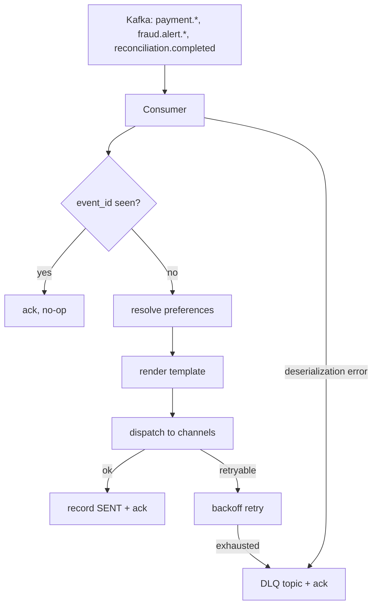

# Implementation Plan: payguard-notification-service

**Owner:** @bereket-7
**Status:** Draft
**Last updated:** 2026-07-29
**Repo:** github.com/bereket-7/payguard-notification-service
**Depends on:** `payguard-event-schemas` (M3), merchant notification preferences from `payguard-user-service` (M4)

---

## 1. Purpose and boundaries

**Owns:** merchant-facing delivery. Consuming every event on the bus and turning it into an email or SMS, with a record of what was sent, to whom, and whether it arrived.

**Does not own:** deciding *that* something is noteworthy — the producing service already made that call by emitting the event. It also does not own merchant identity or preferences, only reading them.

This service consumes from all six topics, making it the widest consumer in the platform and the one most exposed to schema changes. It is also the only service that talks to third-party delivery providers, so it inherits their failure modes: rate limits, soft bounces, and silent drops.

---

## 2. Current state

- [`NotificationServiceApplication.java`](../../services/payguard-notification-service/src/main/java/com/payguard/notification/NotificationServiceApplication.java) — bare `@SpringBootApplication`.
- [`application.yml`](../../services/payguard-notification-service/src/main/resources/application.yml) — app name and `server.port: 8084`.
- `pom.xml` — `web`, `actuator`, `test`. No Kafka, no JPA, no mail.
- `Dockerfile` — single stage, root user.

No consumers, entities, or delivery code exist.

Relevant pre-existing expectations to satisfy rather than invent:

- [`docs/runbooks/kafka-consumer-lag.md`](../runbooks/kafka-consumer-lag.md) specifies the consumer group name **`notification-service`** and lists it as a consumer of all six topics. It also states in Scenario D that "the consumer should be sending unprocessable messages to a dead-letter topic" — so a DLQ is a requirement, not an enhancement.
- The runbook's `kubectl scale --replicas=3` guidance assumes the deployment scales horizontally and that 3 is the effective ceiling, matching the 3 partitions created for the payment and fraud topics.
- The architecture doc's `.env.example` has no SMTP or SMS credentials yet; those need adding.

---

## 3. Target design

```
src/main/java/com/payguard/notification/
├── NotificationServiceApplication.java
├── config/
│   ├── KafkaConfig.java             # Avro consumers, manual ack, DLQ error handler
│   ├── RetryConfig.java
│   └── SecurityConfig.java
├── event/
│   ├── PaymentEventConsumer.java    # payment.created / completed / failed
│   ├── FraudAlertConsumer.java      # fraud.alert.high / medium
│   └── ReconciliationConsumer.java  # reconciliation.completed
├── service/
│   ├── NotificationService.java     # orchestration + idempotency
│   ├── PreferenceService.java       # merchant channel preferences, cached
│   ├── TemplateService.java         # render subject/body
│   └── DeliveryDispatcher.java      # route to channel
├── channel/
│   ├── NotificationChannel.java     # interface
│   ├── EmailChannel.java
│   ├── SmsChannel.java
│   └── NoOpChannel.java             # local development
├── domain/
│   ├── Notification.java            # JPA entity, delivery record
│   ├── NotificationStatus.java      # PENDING/SENT/FAILED/SUPPRESSED
│   └── ProcessedEvent.java          # idempotency ledger keyed by event_id
└── repository/
```

Consumption path:



Two rules make this safe under at-least-once delivery:

1. **Deduplicate on `event_id`** before doing anything with a side effect. Every schema carries `event_id` precisely for this.
2. **Never block the partition.** A message that cannot be processed goes to the DLQ and is acknowledged. The alternative is the stuck-offset incident in Scenario D of the runbook.

---

## 4. Milestones

### M1 — Foundation and delivery ledger

Branch: `feat/notification-foundation`

- Add `spring-boot-starter-data-jpa`, `postgresql`, `flyway-core`, `micrometer-registry-prometheus`.
- `Notification` entity: `notification_id`, `merchant_id`, `event_id`, `event_type`, `channel`, `recipient`, `subject`, `status`, `provider_message_id`, `attempt_count`, `error_message`, `created_at`, `sent_at`.
- `ProcessedEvent` entity keyed by `event_id` with a unique constraint — the database enforces idempotency rather than application logic.
- Flyway `V1__notification.sql`, `V2__processed_event.sql`.
- Multi-stage Dockerfile, non-root user, `.github/workflows/ci.yml`.

**DoD:** schema migrates; a delivery record can be written and queried by merchant.

### M2 — Kafka consumers with DLQ

Branch: `feat/notification-kafka-consumers`

The most important milestone in this repo, because it is where the runbook's assumptions become true.

- Add `spring-kafka`, the Avro serde, and the `event-schemas` artifact.
- Consumer group `notification-service` — exactly the name the runbook documents.
- Subscribe to all six topics with typed Avro deserialization.
- Manual acknowledgement so an offset only advances after processing completes.
- `DefaultErrorHandler` with `DeadLetterPublishingRecoverer` sending failures to `<topic>.dlq` after bounded retries, then acknowledging.
- Deduplicate on `event_id` before side effects.
- Log with `merchant_id` and `event_id` on every path so an incident can be traced to a merchant.

**DoD:** a poison message lands in the DLQ and the consumer keeps advancing; a duplicated event produces exactly one notification record; Testcontainers Kafka test covers both.

### M3 — Templates and channels

Branch: `feat/notification-channels`

- Add `spring-boot-starter-mail` and `spring-boot-starter-thymeleaf`.
- `EmailChannel` via SMTP (SES in production); `SmsChannel` behind an interface with one provider implementation.
- `NoOpChannel` active under the `local` profile, writing to the log instead of sending. Local development must never risk real delivery.
- Templates per event type. `FraudAlert.reasons` renders as a bullet list, and the alert includes the recommended action the architecture doc calls for.
- Money renders from `amount_minor` plus `currency` with correct locale formatting.

**DoD:** each event type renders a reviewed template; local runs log instead of sending; a rendering failure routes to the DLQ rather than crashing the consumer.

### M4 — Preferences and suppression

Branch: `feat/notification-preferences`

- `PreferenceService` reading `GET /internal/v1/merchants/{id}/notification-preferences` from user-service, with a short-TTL local cache.
- **Fallback when user-service is unavailable:** deliver high-severity fraud alerts on all known channels rather than dropping them. A missing preference lookup must not silently suppress a fraud alert.
- Suppression rules: unsubscribed merchants, hard-bounced addresses, and a per-merchant hourly cap to prevent an alert storm.
- Status `SUPPRESSED` recorded with a reason, so "why did I not get an alert" is answerable.

**DoD:** preferences are honoured; with user-service down, high-severity alerts still deliver; suppression is auditable.

### M5 — Reliability and operations

Branch: `feat/notification-reliability`

- Retry with exponential backoff for transient provider failures; immediate DLQ for permanent ones such as an invalid address.
- Provider webhook ingestion for bounces and complaints, updating delivery status.
- `GET /v1/notifications?merchant_id=&status=` for support, merchant-scoped.
- Admin DLQ replay endpoint, which is the tooling the runbook's post-incident section implies.

**DoD:** a bounced email is reflected in the record; a DLQ message can be replayed after a fix.

---

## 5. Interfaces and contracts

### Consumed

All six topics, consumer group `notification-service`:

- `payment.created` → `PaymentCreated`
- `payment.completed` → `PaymentCompleted`
- `payment.failed` → `PaymentFailed` (**needs the schema added** — see the [event-schemas plan](payguard-event-schemas.md))
- `fraud.alert.high` → `FraudAlert` — highest priority, P1 lag threshold of 1 minute per the runbook
- `fraud.alert.medium` → `FraudAlert`
- `reconciliation.completed` → `ReconciliationCompleted` — rendered as the settlement report

### Produced

- `<topic>.dlq` for each consumed topic

### Provided

- `GET /v1/notifications` — support and merchant self-service
- `POST /v1/webhooks/{provider}` — delivery status callbacks
- `POST /internal/v1/dlq/replay` — admin only

---

## 6. Data model and migrations

Database `payguard_notifications` (local port 5436):

- `V1__notification.sql` — indexed on `(merchant_id, created_at)` and on `status`
- `V2__processed_event.sql` — unique on `event_id`
- `V3__suppression.sql`
- `V4__delivery_status.sql`

The `notification` table is the highest-volume table in the platform, since every payment produces at least one row. Plan monthly partitioning and a retention policy before volume forces it.

---

## 7. Configuration

- Port **8084** (no conflict; note `.env.example` currently misuses this port as the Fraud Engine URL — see the [payment-service plan](payguard-payment-service.md))
- `SPRING_DATASOURCE_URL=jdbc:postgresql://localhost:5436/payguard_notifications`
- `SPRING_KAFKA_BOOTSTRAP_SERVERS`, `SPRING_KAFKA_PROPERTIES_SCHEMA_REGISTRY_URL`
- New, to add to `local-dev/.env.example`: `SPRING_MAIL_HOST`, `SPRING_MAIL_PORT`, `SPRING_MAIL_USERNAME`, `SPRING_MAIL_PASSWORD`, `SMS_PROVIDER_API_KEY`, `PAYGUARD_NOTIFICATION_FROM_ADDRESS`, `USER_SERVICE_BASE_URL`
- New keys: `payguard.notification.max-per-merchant-per-hour`, `payguard.notification.retry.max-attempts`

---

## 8. Testing strategy

- **Unit:** template rendering per event type, suppression rules, channel selection, money and locale formatting.
- **Integration (Testcontainers Kafka + Postgres):** end-to-end consume-to-record for each topic; DLQ routing on unprocessable payload; duplicate `event_id` producing one record; offset advancement after DLQ.
- **Provider:** GreenMail for SMTP, WireMock for SMS. Never a real provider in CI.
- **Resilience:** user-service down (high-severity alerts still deliver), provider returning 429, malformed Avro payload.
- **Load sanity:** a burst on `payment.created` should be absorbed without unbounded lag, since Scenario C of the runbook expects transient bursts to drain.

---

## 9. Observability and SLOs

SLO: high-severity fraud alerts dispatched within **60 seconds** of the event, which is the threshold the runbook pages on.

Metrics: `notification.consumed.count` by topic, `notification.delivered.count` by channel and status, `notification.dlq.count` by topic, `notification.duplicate.count`, `notification.suppressed.count` by reason, `notification.provider.latency`, and Kafka consumer lag per topic.

Consumer lag on `fraud.alert.high` is the P1 signal; `notification.dlq.count` becoming non-zero should alert immediately, because a DLQ message is a notification a merchant never received.

---

## 10. Security

- Notification content is merchant-visible and may quote transaction amounts and identifiers — never card data, and never a Stripe token.
- Every query filtered by `merchant_id`; the support endpoint requires an elevated role.
- Provider credentials from Secrets Manager.
- Provider webhooks signature-verified before use, the same discipline as Stripe webhooks in payment-service.
- Recipient addresses are personal data: redact in logs, and honour deletion requests through the suppression table.
- Unsubscribe links must not be forgeable — sign them.

---

## 11. Risks and open questions

- **`payment.failed` cannot be consumed until its schema exists.** Hard dependency on event-schemas M1.
- **Preference lookup creates a synchronous dependency** on user-service, which cuts against the async-everywhere principle in ADR-003. The alternative is consuming a `merchant.updated` event and keeping a local replica. That is more consistent architecturally and removes a failure mode; worth an ADR, and it is also raised in the [user-service plan](payguard-user-service.md).
- **Alert storms.** A fraud incident or a batch payment run can generate thousands of notifications in seconds. The per-merchant hourly cap in M4 is a blunt instrument; digesting or aggregating may be needed, which is a product decision.
- **Notifying on `payment.created` may be noise.** Every payment generating an email is likely unwanted at volume. Confirm which events merchants actually want per channel before building templates for all six.
- **DLQ topics are not created by the local stack.** `kafka-init` in `docker-compose.yml` creates only the six main topics; add the six `.dlq` topics in the umbrella, or rely on auto-creation, which is enabled locally but should not be in production.

---

## 12. Definition of done

- All six topics consumed under group `notification-service`, with no topic able to block a partition.
- Duplicate events never produce duplicate notifications.
- Unprocessable messages land in a DLQ, are visible in metrics, and can be replayed.
- High-severity fraud alerts reach merchants within 60 seconds, even with user-service unavailable.
- Every notification is auditable: what was sent, to whom, on which channel, and its delivery outcome.
- Every instruction in `kafka-consumer-lag.md` is executable against the real service.
