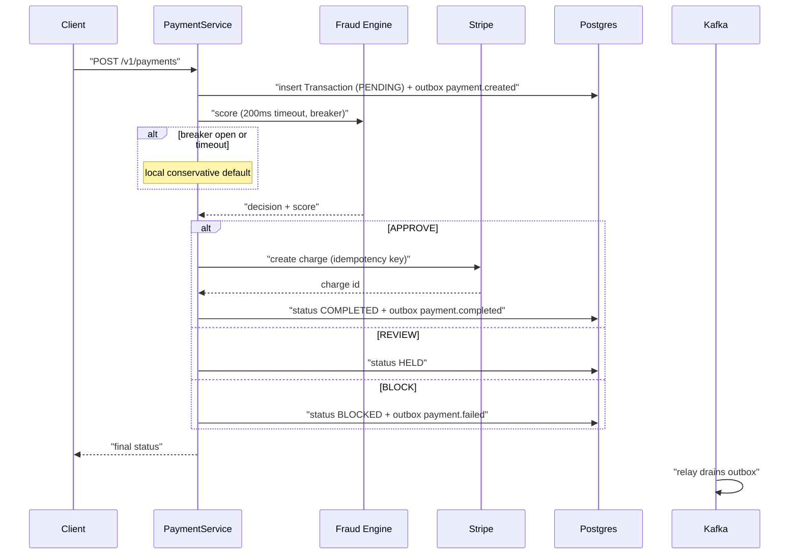

# Implementation Plan: payguard-payment-service

**Owner:** @bereket-7
**Status:** Mostly complete
**Last updated:** 2026-08-20
**Repo:** github.com/bereket-7/payguard-payment-service
**Depends on:** `payguard-event-schemas`, `payguard-fraud-engine`, Keycloak JWKS, a Stripe test account

---

## 1. Purpose and boundaries

**Owns:** the transaction lifecycle. Accepting a payment request, getting a fraud decision, creating the Stripe charge, processing Stripe webhooks, and publishing `payment.*` events reliably.

**Does not own:** the fraud decision itself, merchant identity, notifying anyone, or settlement matching. It is the orchestrator of one transaction, not the owner of the surrounding business processes.

This service holds the most consequential correctness requirement in the platform: money moves here, and the event stream it publishes is what Reconciliation later treats as the source of truth. Losing an event is worse than failing a request.

---

## 2. Current state

*(Surveyed 2026-08-20 against the submodule HEAD.)*

**Implemented (M1–M6 largely done):**

- Port **8082**; Flyway V1–V5 (transaction, outbox, webhook, review audit, outbox retry)
- Controllers: `PaymentController`, `StripeWebhookController`, `TransactionReviewController`; `ApiExceptionHandler`
- Services: `PaymentService`, Stripe charge/refund, `FraudEngineClient` (Resilience4j circuit breaker + internal token), webhook processing, review queue
- Outbox: JPA `OutboxEntry` + polling `OutboxRelay` ([ADR-004](../adr/ADR-004-polling-outbox-relay.md)) with retry/backoff; Avro via Schema Registry
- Auth: Keycloak JWT resource server; Stripe webhook signature-verified and public
- Unit tests (`PaymentService`, `FraudEngineClient`, `OutboxEntry`); CI + multi-stage non-root Dockerfile

**Remaining:**

- Thin automated coverage — no Testcontainers outbox → Kafka or webhook integration tests
- mTLS to fraud-engine not implemented in-app (infra)
- Operational REVIEW SLA / expired-hold policy still a product decision
- Refund reconciliation coordination with reconciliation-service still open

---

## 3. Target design

```
src/main/java/com/payguard/payment/
├── PaymentServiceApplication.java
├── config/
│   ├── StripeConfig.java
│   ├── KafkaConfig.java
│   ├── SecurityConfig.java
│   └── ResilienceConfig.java        # circuit breaker + timeout for the fraud call
├── controller/
│   ├── PaymentController.java       # POST /v1/payments, GET /v1/payments/{id}
│   └── StripeWebhookController.java # POST /v1/webhooks/stripe
├── service/
│   ├── PaymentService.java          # orchestration
│   ├── FraudEngineClient.java       # sync REST + circuit breaker
│   ├── StripeChargeService.java
│   └── WebhookProcessingService.java
├── domain/
│   ├── Transaction.java             # JPA entity
│   ├── TransactionStatus.java       # enum
│   └── ProcessedWebhook.java        # idempotency ledger
├── outbox/
│   ├── OutboxEntry.java             # becomes a JPA entity
│   ├── OutboxRepository.java
│   └── OutboxRelay.java             # publisher (see M4 / ADR-004)
└── repository/
    ├── TransactionRepository.java
    └── ProcessedWebhookRepository.java
```

The charge flow, with the ordering that makes it safe:



The invariant worth defending in review: **the transaction row and its event are written in the same local transaction.** No event is ever published by application code at the point the state changes — only by the relay, from committed rows. That is what makes a crash mid-write safe.

---

## 4. Milestones

### M1 — Transaction persistence and API skeleton

Branch: `feat/payment-transaction-persistence`

- Add `spring-boot-starter-data-jpa`, `postgresql`, `flyway-core`, `spring-boot-starter-validation`, `micrometer-registry-prometheus`.
- `Transaction` entity: `transaction_id`, `merchant_id`, `amount_minor`, `currency`, `status`, `stripe_charge_id`, `fraud_score`, `fraud_decision`, `created_at`, `updated_at`.
- `TransactionStatus`: `PENDING`, `APPROVED`, `HELD`, `BLOCKED`, `COMPLETED`, `FAILED`, `REFUNDED`.
- Flyway `V1__transaction.sql` with a unique index on `transaction_id` and an index on `(merchant_id, created_at)`.
- `POST /v1/payments` and `GET /v1/payments/{id}`, persisting as `PENDING` with no Stripe call yet.
- Multi-stage Dockerfile, non-root user, `.github/workflows/ci.yml`.

**DoD:** a payment request persists and is retrievable; Testcontainers Postgres test passes.

### M2 — Synchronous fraud call with circuit breaker

Branch: `feat/payment-fraud-engine-client`

This is the milestone that implements ADR-003, so it should follow the ADR literally.

- Add `spring-cloud-starter-circuitbreaker-resilience4j` and `spring-boot-starter-actuator` metrics binding.
- `FraudEngineClient` using `RestClient` with a **200ms** total timeout from `FRAUD_ENGINE_TIMEOUT_MS`.
- Resilience4j circuit breaker named `fraudEngine`, registered so that `/actuator/metrics/resilience4j.circuitbreaker.state` resolves — the degraded runbook instructs on-call to curl exactly that path.
- Fallback when the breaker is open or the call times out: a conservative local default that lets low-value transactions through and holds high-value ones. Payments must not be blocked wholesale by Fraud Engine unavailability, per ADR-003.
- Fix `FRAUD_ENGINE_BASE_URL` to port 8083 in `local-dev/.env.example` (umbrella PR) and in this repo's README.
- Record `fraud_score` and `fraud_decision` on the transaction.

**DoD:** with Fraud Engine stopped, payments still resolve via the fallback and the breaker metric reports `OPEN`.

### M3 — Stripe charge creation

Branch: `feat/payment-stripe-charges`

- Add `com.stripe:stripe-java`.
- `StripeChargeService` creating a PaymentIntent from a client-supplied token, using `transaction_id` as the **Stripe idempotency key** so a retried request never double-charges.
- Handle `CardException`, `RateLimitException`, and `ApiConnectionException` distinctly; only connection errors are retryable.
- `POST /v1/payments/{id}/refund`.
- Never log the token, and never persist anything beyond the Stripe charge ID — the PCI boundary in the architecture doc depends on it.

**DoD:** an approved payment produces a charge in Stripe test mode; replaying the same request produces no second charge.

### M4 — Transactional outbox

Branch: `feat/payment-outbox-relay`

**Blocked on ADR-004.** The architecture doc names Debezium as the CDC relay, but there is no Kafka Connect in [`local-dev/docker-compose.yml`](../../local-dev/docker-compose.yml) and no Debezium anywhere in the platform. Write the ADR first; the options are:

- **Debezium via Kafka Connect** — true CDC, no polling lag, but adds Connect to the local stack and to `payguard-infrastructure`, plus a connector to operate.
- **Polling relay inside this service** — a scheduled query over unpublished rows with `SKIP LOCKED`. Far less infrastructure, at the cost of a small polling interval and a component to make multi-replica safe.

Recommendation: start with the polling relay to unblock consumers, and treat Debezium as a later swap. The outbox table shape does not change, so the decision is reversible — which is exactly the argument the ADR should make.

- Convert `OutboxEntry` to a JPA entity: add `created_at`, `published_at`, `topic`, and `partition_key`.
- Write the outbox row in the **same** `@Transactional` method as the state change.
- `OutboxRelay` publishing to Kafka via the `event-schemas` artifact, keyed by `merchant_id`, marking rows published only after broker acknowledgement.
- Flyway `V2__outbox.sql`, indexed on `published_at IS NULL`.

**DoD:** killing the process between the DB commit and the publish still results in the event being published on restart; no duplicate row is published under two replicas.

### M5 — Stripe webhooks

Branch: `feat/payment-stripe-webhooks`

- `POST /v1/webhooks/stripe` verifying the signature with `STRIPE_WEBHOOK_SECRET` via `Webhook.constructEvent` **before** any parsing or state change.
- Idempotency: persist the Stripe event ID in `ProcessedWebhook` and ignore repeats. Stripe redelivers, so this is required rather than defensive.
- Handle `payment_intent.succeeded`, `payment_intent.payment_failed`, `charge.refunded`, `charge.dispute.created`.
- Return 2xx quickly and process asynchronously where handling is non-trivial; Stripe retries on timeout.

**DoD:** an unsigned request is rejected with 400 and changes no state; a redelivered event is a no-op.

### M6 — Review queue for held transactions

Branch: `feat/payment-review-queue`

Closes the loop the architecture doc leaves open: a `REVIEW` decision holds the transaction, but nothing releases it.

- `GET /v1/transactions?status=HELD` scoped to the merchant.
- `POST /v1/transactions/{id}/approve` and `/reject`, requiring an elevated role and writing an audit row with the acting user.
- Approval resumes the charge; rejection publishes `payment.failed`.

**DoD:** a held transaction can be approved end to end and results in a charge plus `payment.completed`.

---

## 5. Interfaces and contracts

### Provided

- `POST /v1/payments` — create; returns final status and fraud decision
- `GET /v1/payments/{id}` — fetch, merchant-scoped
- `POST /v1/payments/{id}/refund`
- `GET /v1/transactions?status=HELD`
- `POST /v1/transactions/{id}/approve` | `/reject`
- `POST /v1/webhooks/stripe` — unauthenticated, signature-verified

### Consumed (synchronous)

`POST /internal/v1/score` on Fraud Engine. 200ms hard timeout, circuit-breaker wrapped, mTLS in cluster. This is the platform's only synchronous inter-service dependency.

### Produced

- `payment.created` — on transaction insert
- `payment.completed` — on successful charge
- `payment.failed` — on block, charge failure, or review rejection

All keyed by `merchant_id`, all published only through the outbox relay.

---

## 6. Data model and migrations

Database `payguard_payments` (local port 5434), Flyway-managed:

- `V1__transaction.sql`
- `V2__outbox.sql`
- `V3__processed_webhook.sql`
- `V4__transaction_review_audit.sql`

Money is stored as `amount_minor` (`bigint`) with a separate `currency` — never a float. `Transaction` is the aggregate root; the outbox row is written under its transaction boundary.

---

## 7. Configuration

- Port **8082**
- `SPRING_DATASOURCE_URL=jdbc:postgresql://localhost:5434/payguard_payments`
- `STRIPE_API_KEY`, `STRIPE_WEBHOOK_SECRET`
- `FRAUD_ENGINE_BASE_URL` — **must be `http://localhost:8083`**, currently wrong in the env reference
- `FRAUD_ENGINE_TIMEOUT_MS=200`
- `SPRING_KAFKA_BOOTSTRAP_SERVERS`, `SPRING_KAFKA_PROPERTIES_SCHEMA_REGISTRY_URL`
- New: `payguard.outbox.poll-interval-ms`, `payguard.outbox.batch-size`

---

## 8. Testing strategy

- **Unit:** status transitions, fallback decision logic, idempotency-key derivation, webhook signature rejection.
- **Integration (Testcontainers):** Postgres for transactions and outbox; Kafka for relay publication; WireMock for the Fraud Engine, including forced 250ms delay to prove the timeout fires.
- **Stripe:** the official mock or recorded fixtures. Never hit the live API in CI.
- **Crash-safety test, the most valuable test in this repo:** commit a transaction plus outbox row, kill the relay before publish, restart, assert exactly one message on Kafka.
- **Idempotency:** replay the same payment request and the same webhook; assert one charge and one state change.

---

## 9. Observability and SLOs

SLO: p99 of `POST /v1/payments` under **500ms** end to end, of which at most 200ms is the fraud call.

Metrics: `payment.request.latency`, `payment.status.count` by status, `payment.fraud.fallback.count`, `resilience4j.circuitbreaker.state` (required by the runbook), `payment.outbox.pending` gauge, `payment.outbox.lag`, `payment.webhook.count` by type and outcome.

`payment.outbox.pending` climbing is the earliest warning that events are silently not reaching Kafka, which would corrupt reconciliation days later. It deserves an alert and probably a runbook of its own.

---

## 10. Security

- **Card data never lands here.** Stripe.js tokenizes client-side; this service sees tokens and charge IDs only. No field on `Transaction` may hold a PAN, CVC, or expiry.
- JWT validated independently; every read is filtered by the token's `merchant_id`.
- Webhook endpoint is unauthenticated by necessity and therefore signature-verified before parsing.
- Stripe keys come from Secrets Manager, never source. `.env` is gitignored.
- Refunds and review approvals require an elevated role and are audit-logged with the acting user.
- mTLS on the Fraud Engine hop, per ADR-003.

---

## 11. Risks and open questions

- **ADR-004 (outbox relay) is a hard blocker for M4** and shapes the local stack and infrastructure repo.
- **Double-charge on retry** is the worst realistic failure. The Stripe idempotency key derived from `transaction_id` is the control; it needs an explicit test, not just a code comment.
- **Fallback policy is a business decision, not an engineering one.** "Approve low-value transactions when the fraud engine is down" trades fraud loss against revenue loss. Needs product sign-off and should be configurable per merchant tier.
- **`REVIEW` releases are unspecified** — who reviews, within what SLA, and what happens to an expired hold. M6 assumes merchant self-service.
- **Refund reconciliation** is not in any topic today. Reconciliation matches payouts to `payment.completed`; refunds will not match. Coordinate with the [reconciliation plan](payguard-reconciliation-service.md).

---

## 12. Definition of done

- A payment is scored, charged, and persisted with a full audit trail.
- No event is ever published without its state change committed, and none is lost across a crash.
- Replays are safe: one request equals one charge, one webhook equals one state change.
- No card data exists anywhere in the service, its logs, or its database.
- The circuit breaker metric the degraded runbook depends on resolves.
