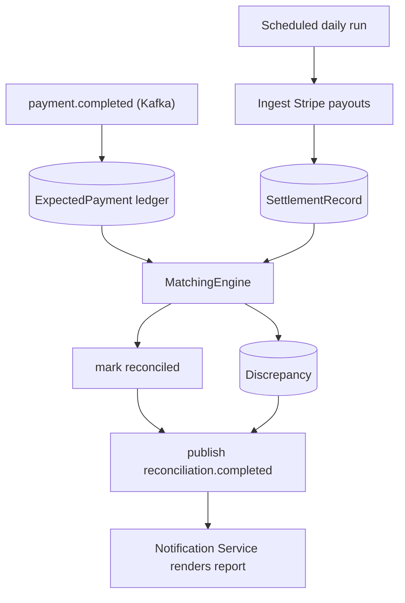

# Implementation Plan: payguard-reconciliation-service

**Owner:** @bereket-7
**Status:** Mostly complete
**Last updated:** 2026-08-20
**Repo:** github.com/bereket-7/payguard-reconciliation-service
**Depends on:** `payguard-event-schemas`, `payguard-payment-service` outbox publishing, Stripe payout access

---

## 1. Purpose and boundaries

**Owns:** financial truth. Every day, prove that what PayGuard believes happened matches what Stripe actually settled, flag anything that does not match, and publish the outcome.

**Does not own:** creating or modifying payments, notifying anyone (it publishes an event and Notification Service renders the report), or accounting itself.

This is the only service whose correctness is judged by an auditor rather than a user. Two properties matter more than anything else: a discrepancy must never be silently dropped, and a reconciliation run must be repeatable with an identical result. Both push the design toward immutable run records rather than mutable state.

---

## 2. Current state

*(Surveyed 2026-08-20 against the submodule HEAD.)*

**Implemented (M1–M5 largely done; M6 partial):**

- Port **8085**; Flyway V1–V3 (ledger, run lock, outbox)
- Ledger from payment events; `MatchingEngine`; Stripe payout ingest; scheduled/manual runs with lock (`ReconciliationLockService`)
- Controllers: `RunController`, `InternalRunController`; reporting/discrepancy path
- Outbox + Avro `reconciliation.completed` publisher; Kafka consumer group `reconciliation-service`
- Auth: Keycloak JWT + internal token for `/internal/**`
- Unit test: `MatchingEngineTest`; CI + multi-stage non-root Dockerfile

**Remaining:**

- Thin automated coverage beyond matching unit tests
- Not routed via API gateway (admin path is network-restricted / direct)
- Refund / dispute handling (M6) and full Stripe payout E2E still open

---

## 3. Target design

```
src/main/java/com/payguard/reconciliation/
├── ReconciliationServiceApplication.java
├── config/
│   ├── KafkaConfig.java
│   ├── SchedulerConfig.java
│   ├── StripeConfig.java
│   └── SecurityConfig.java
├── event/
│   ├── PaymentEventConsumer.java        # builds the expected ledger
│   └── ReconciliationEventProducer.java # reconciliation.completed
├── ingest/
│   ├── StripePayoutClient.java          # payout + balance transaction API
│   └── PayoutIngestService.java
├── matching/
│   ├── MatchingEngine.java              # deterministic, pure
│   ├── MatchRule.java                   # exact, then tolerance-based
│   └── MatchResult.java
├── service/
│   ├── ReconciliationRunService.java    # orchestrates a run
│   └── ReportService.java
├── domain/
│   ├── ExpectedPayment.java             # local ledger from events
│   ├── SettlementRecord.java            # from Stripe
│   ├── ReconciliationRun.java           # immutable run header
│   ├── Discrepancy.java
│   └── DiscrepancyType.java
└── repository/
```

The daily run:



The key design choice: **build the expected ledger continuously from events, not by querying Payment Service.** Reconciliation must be independent of the service it is auditing — that independence is the entire point. It also means the ledger is a local, queryable projection rather than a cross-service join, which the database-per-service principle forbids anyway.

A `ReconciliationRun` is immutable once complete. Re-running a date produces a **new** run with its own ID rather than mutating the previous one, so history is auditable and a re-run after a fix is provably comparable.

---

## 4. Milestones

### M1 — Expected-payment ledger from events

Branch: `feat/reconciliation-expected-ledger`

- Add `spring-boot-starter-data-jpa`, `postgresql`, `flyway-core`, `spring-kafka`, the Avro serde, the `event-schemas` artifact, `micrometer-registry-prometheus`.
- Consumer group `reconciliation-service` — the name the runbook documents — on `payment.created` and `payment.completed`.
- `ExpectedPayment` entity: `transaction_id`, `merchant_id`, `amount_minor`, `currency`, `stripe_charge_id`, `status`, `expected_at`, `reconciled_at`, `run_id`.
- Idempotent upsert keyed by `transaction_id`, with `event_id` deduplication so replays are safe.
- DLQ handling identical in shape to the notification service, so a bad message never blocks the partition.
- Multi-stage Dockerfile, non-root user, `.github/workflows/ci.yml`.

**DoD:** replaying the topic from offset zero produces an identical ledger; duplicate events change nothing.

### M2 — Stripe payout ingestion

Branch: `feat/reconciliation-payout-ingest`

- Add `com.stripe:stripe-java`.
- `StripePayoutClient` listing payouts for a date range and their balance transactions, paginating fully — a partial fetch would manufacture false discrepancies, which is worse than failing the run.
- `SettlementRecord` entity: `stripe_payout_id`, `stripe_charge_id`, `merchant_id`, `gross_minor`, `fee_minor`, `net_minor`, `currency`, `settled_at`, `raw_payload`.
- Store the raw payload. When finance disputes a number months later, the original response is the only defensible evidence.
- Idempotent ingestion keyed by `stripe_payout_id`.

**DoD:** ingesting the same date twice yields no duplicate settlement rows; fees are captured separately from gross.

### M3 — Matching engine

Branch: `feat/reconciliation-matching-engine`

- `MatchingEngine` as a **pure function** over two collections, with no I/O. This is what makes it exhaustively unit-testable and its results reproducible, which is the property an auditor cares about.
- Rules applied in order: exact match on `stripe_charge_id`; then amount-and-merchant match within a configured tolerance to absorb fee rounding; anything left is a discrepancy.
- `DiscrepancyType`: `MISSING_IN_SETTLEMENT` (we recorded a payment Stripe did not settle), `MISSING_IN_LEDGER` (Stripe settled something we have no record of — the most serious case), `AMOUNT_MISMATCH`, `CURRENCY_MISMATCH`, `DUPLICATE_SETTLEMENT`, `LATE_SETTLEMENT`.
- Every discrepancy records both sides and the rule that failed, so it is actionable without re-running anything.

**DoD:** a fixture-driven test suite covers every discrepancy type; matching the same inputs twice gives identical output.

### M4 — Scheduled run and event publication

Branch: `feat/reconciliation-daily-run`

- `ReconciliationRun` entity: `run_id`, `settlement_date`, `started_at`, `completed_at`, `status`, `expected_count`, `settled_count`, `matched_count`, `discrepancy_count`.
- Scheduled daily run at a configured time, with a **distributed lock** so multiple replicas cannot run the same date concurrently.
- Publish `ReconciliationCompleted` to `reconciliation.completed` keyed by `merchant_id`, populating `settlement_id`, `match_status`, and `discrepancy_count`.
- Manual trigger: `POST /internal/v1/runs?date=YYYY-MM-DD`, admin only, creating a new run rather than mutating a prior one.
- Late-arriving settlements handled by allowing a date to be re-run within a configurable window.

**DoD:** a scheduled run completes, publishes exactly one event per merchant, and is visible as an immutable run record; two replicas produce one run.

### M5 — Reporting and discrepancy workflow

Branch: `feat/reconciliation-reporting`

- `GET /v1/runs`, `GET /v1/runs/{id}`, `GET /v1/runs/{id}/discrepancies`, all merchant-scoped.
- CSV export for finance.
- Discrepancy resolution: assign, annotate, and close with a reason, preserving the original finding. Resolution never deletes or edits the finding.
- `GET /v1/reports/settlement?from=&to=` summary.

**DoD:** finance can export a run and close a discrepancy with an audit trail that retains the original.

### M6 — Refund and dispute handling

Branch: `feat/reconciliation-refunds-disputes`

Closes a real gap: today nothing on the bus describes refunds, so refunded charges would reconcile as amount mismatches forever.

- Consume refund and dispute events once payment-service publishes them (coordinate with the [payment-service plan](payguard-payment-service.md)).
- Extend matching to net refunds and dispute reversals against the original charge.

**DoD:** a refunded payment reconciles cleanly rather than producing a false discrepancy.

---

## 5. Interfaces and contracts

### Consumed

- `payment.created` — expected-set candidates, group `reconciliation-service`
- `payment.completed` — the authoritative expected set

### Produced

- `reconciliation.completed` — `ReconciliationCompleted`, keyed by `merchant_id`, 1 partition

### External

Stripe payout and balance-transaction APIs. Note the architecture doc says Stripe "delivers the daily settlement file" — in practice this is a pull from the API, not a pushed file, unless Stripe Report Runs are used. Worth aligning the doc with whichever is implemented.

### Provided

- `GET /v1/runs`, `/v1/runs/{id}`, `/v1/runs/{id}/discrepancies`
- `GET /v1/reports/settlement`
- `POST /internal/v1/runs` — admin trigger

---

## 6. Data model and migrations

Database `payguard_reconciliation` (local port 5437):

- `V1__expected_payment.sql` — unique on `transaction_id`, indexed on `(merchant_id, expected_at)`
- `V2__settlement_record.sql` — unique on `stripe_payout_id` plus `stripe_charge_id`
- `V3__reconciliation_run.sql`
- `V4__discrepancy.sql` — indexed on `(run_id, type)`
- `V5__discrepancy_resolution.sql`

All amounts are `bigint` minor units with an explicit currency. Never floating point — a rounding artefact here becomes a discrepancy investigation.

Retention is longer than anywhere else in the platform: financial records typically need seven years. Do not apply a short default retention to these tables.

---

## 7. Configuration

- Port **8085**
- `SPRING_DATASOURCE_URL=jdbc:postgresql://localhost:5437/payguard_reconciliation`
- `SPRING_KAFKA_BOOTSTRAP_SERVERS`, `SPRING_KAFKA_PROPERTIES_SCHEMA_REGISTRY_URL`
- `STRIPE_API_KEY` — read-only restricted key is sufficient and preferable
- New: `payguard.reconciliation.schedule-cron`, `payguard.reconciliation.amount-tolerance-minor`, `payguard.reconciliation.late-settlement-window-days`, `payguard.reconciliation.rerun-window-days`

---

## 8. Testing strategy

- **Unit, and this is where the value is:** `MatchingEngine` against fixtures for every discrepancy type, tolerance boundaries, multi-currency, duplicate settlements, and the empty-input case. Because the engine is pure, these tests are fast and complete.
- **Integration (Testcontainers Postgres + Kafka):** ledger construction from a replayed topic; idempotent payout ingestion; run publication.
- **Stripe:** recorded fixtures including a multi-page payout list, to prove pagination is complete.
- **Determinism test:** the same inputs run twice produce byte-identical results.
- **Concurrency test:** two schedulers attempting the same date produce one run.
- **Property-based test worth adding:** for any generated ledger and settlement set, matched plus discrepancies always equals the total on both sides. Nothing may be silently dropped.

---

## 9. Observability and SLOs

SLO: the daily run for date D completes before the finance cutoff on D+1, and consumer lag never spans a settlement window — the 24-hour threshold in the runbook that triggers notifying finance.

Metrics: `reconciliation.run.duration`, `reconciliation.run.status`, `reconciliation.matched.count`, `reconciliation.discrepancy.count` by type, `reconciliation.ledger.size`, `reconciliation.stripe.ingest.latency`, and consumer lag.

`MISSING_IN_LEDGER` deserves its own alert regardless of count: Stripe settling something PayGuard has no record of implies a lost event, which points at the payment-service outbox rather than at reconciliation. It is the platform's canary for event loss.

---

## 10. Security

- Financial data, so access is tightly scoped: merchant-scoped reads, finance and platform-admin roles for cross-merchant reporting.
- Stripe key should be a restricted read-only key — this service never needs to move money.
- Raw payloads are stored, so verify they contain no card data before persisting; store only what Stripe returns for payouts and balance transactions.
- Discrepancy resolutions are append-only with the acting user recorded.
- Exports are audit-logged, since a full settlement export is sensitive.

---

## 11. Risks and open questions

- **Reconciliation depends on the payment outbox being correct.** If events are lost, this service reports discrepancies that are really upstream bugs. That is arguably a feature — it is the detection mechanism — but it means ADR-004 and payment-service M4 gate meaningful output here.
- **Refunds and disputes are not on the bus** and will produce false discrepancies until M6. This is the most likely source of early noise.
- **"Settlement file" versus API pull** is unresolved in the architecture doc. Align the doc with the implementation.
- **Fee handling.** Stripe settles net of fees, so matching gross amounts naively will mismatch on every row. Fees must be modelled explicitly, which is why `SettlementRecord` separates gross, fee, and net.
- **Multi-currency and FX** are unaddressed. If merchants settle in a different currency than they charge, matching needs an FX rate source and a stated policy.
- **Timezone of the settlement date** must be pinned explicitly. An off-by-one-day boundary produces systematic false discrepancies at the edges of every run.

---

## 12. Definition of done

- A daily run completes automatically, produces an immutable record, and publishes one event per merchant.
- The matching engine is deterministic and covers every discrepancy type with tests.
- Nothing is silently dropped: matched plus discrepancies always accounts for every input on both sides.
- Finance can export a run and resolve discrepancies without losing the original finding.
- `MISSING_IN_LEDGER` alerts, because it means the platform lost an event.
